```{r setup, include=FALSE}
knitr::opts_chunk$set(echo = TRUE)
```
\newpage

# Dataset
For the Seminar we use the south German credit dataset, available in the UCI Machine learning repository @south-german-credit-ds.

The dataset consists of a 1000 observations together with 21 attributes. The data was collected between 1973 and 1975. The task associated with this data set is the classification of individuals (instances) according to their credit risk ("good", "bad").


| Attribute | Description                 |
| --------- |-----------------------------|
| status | Status of the debtor's checking account with the bank\
(factor with 4 levels: _"no checking account"_, _"... < 0 DM"_,\
_"0<= ... < 200 DM"_, _"... >= 200 DM / salary for at least 1 year"_) |
| duration | Credit duration in months (int) |
| credit_history | History of the compliance with previous or current credit contracts\
(factor with 5 levels: _"delay in paying off in the past"_,\
_"critical account/other credits elsewhere"_, _"no credits taken/all credits paid back duly"_,\
_"existing credits paid back duly till now"_, _"all credits at this bank paid back duly"_) |
| purpose| Purpose for which the credit is needed\
(factor with 11 levels: _"others"_, _"car (new)"_, _"car (used)"_, _"furniture/equipment"_,\
_"radio/television"_, _"domestic appliances"_, _"repairs"_, _"education"_,\
_"vacation"_, _"retraining"_, _"business"_) |
| amount| Amount in DM (int) |
| savings| Debtor's savings\
(factor with 5 levels:  _"unknown/no savings account"_, _"... <  100 DM"_,\
_"100 <= ... <  500 DM"_, _"500 <= ... < 1000 DM"_, _"... >= 1000 DM"_) |
| employment_duration| Duration of debtor's employment with current employer\
(factor with 5 levels: _"unemployed"_, _"< 1 yr"_, _"1 <= ... < 4 yrs"_,\
_"4 <= ... < 7 yrs"_, _">= 7 yrs"_) |
| installment_rate| Credit installments as a percentage of debtor's disposable income\
(ordered factor with 4 levels: _">= 35"_ < _"25 <= ... < 35"_ < _"20 <= ... < 25"_ < _"< 20"_) |
| personal_status_sex | Combined information on sex and marital status\
(factor with 4 levels: _"male : divorced/separated"_, _"female : non-single or male : single"_,\
_"male : married/widowed"_, _"female : single"_) |
| other_debtors | Is there another debtor or a guarantor for the credit?\
(factor with 3 levels: _"none"_, _"co-applicant"_, _"guarantor"_) |
| present_residence| Length of time (in years) the debtor lives in the present residence\
(ordered factor with 4 levels: _"< 1 yr"_ < _"1 <= ... < 4 yrs"_ \
< _"4 <= ... < 7 yrs"_ < _">= 7 yrs"_) |
| property | The debtor's most valuable property\
(factor with 4 levels: _"unknown / no property"_, _"car or other"_,\
_"building soc. savings agr./life insurance"_, _"real estate"_) |
| age | Age in years (int) |
| other_installment_plans | Installment plans from providers other than the credit-giving bank\
(factor with 3 levels: _"bank"_, _"stores"_, _"none"_) |
| housing | Type of housing the debtor lives in\
(factor with 3 levels: _"for free"_, _"rent"_, _"own"_) |
| number_credits | Number of credits including the current one the debtor has (or had) at this bank\
(ordered factor with 4 levels: _"1"_ < _"2-3"_ < _"4-5"_ < _">= 6"_) |
| job | Quality of debtor's job\
(factor with 4 levels: _"unemployed/unskilled - non-resident"_, _"unskilled - resident"_,\
_"skilled employee/official"_, _"manager/self-empl./highly qualif. employee"_) |
| people_liable | Number of persons who financially depend on the debtor (i.e., are entitled to maintenance)\
(factor with 2 levels: _"3 or more"_, _"0 to 2"_) |
| telephone | Is there a telephone landline registered on the debtor's name?\
(factor with 2 levels: _"no"_, _"yes (under customer name)"_) |
| foreign_worker | Is the debtor a foreign worker?\
(factor with 2 levels: _"yes"_, _"no"_) |
| credit_risk | Has the credit contract been complied with (good) or not (bad)?\
(factor with 2 levels: _"bad"_, _"good"_) |

Table: Dataset

## Dataset Summary
```{r, include=FALSE}
# Load necessary libraries
library("mlr3verse")
library("ggplot2")

theme_set(theme_bw())

set.seed(20211301)
lgr::get_logger("mlr3")$set_threshold("error")
```

```{r}
load("south-german-credit.Rda")
task <- TaskClassif$new("german-credit",
  backend = data,
  target = "credit_risk",
  positive = "good"
)
task$col_roles$stratum <- "credit_risk"
```

```{r warning=FALSE, results='hold', echo=FALSE}
skimr::skim_without_charts(data)
```

The data set doesn't have any missing values and requires little preprocessing to fit our model. It can also be pointed out that the data has a class-imbalance problem: The number of "good" credited people is more than twice the number of "bad" credited people (700 to 300), as seen in the data set summary above.

\newpage

# Model Selection
The `mlr3`^[https://mlr3.mlr-org.com/] package and other packages from the `mlr3` ecosystem are used to do the modeling.
The fitted and tuned models are:

- Logistic Regression
- Decision Tree
- Random Forest
- Xgboost
- Support Vector machines (with linear, polynomial, and radial kernels)

, in which, logistic regression and decision tree are considered as explainable baseline models; random forest, Xgboost and support vector machines with multiple kernel types as blackbox models.

For preprocessing, we do the following:

- Standardize numerical variables by centering them around their mean and scaling them by their root-mean-square.
- One-hot encode factor and ordered-factor variables.
- To account for the class imbalance in the data set, we perform oversampling of the minority class ("bad" class). We set the oversampling ratio at `2.3`, as this is approximately the factor by which the minority class varies from the majority class.
- To make the model aware of the classification cost, we apply thresholding. The `threshold` is the probability value over which a model predicts the positive class, (e.g. predict "good" if the model output is > `0.5`). The `threshold` parameter is tuned together with other model parameters.

We use `mlr3pipelines`^[https://mlr3pipelines.mlr-org.com/] to build a learner that combines both data processing and modeling. Figure \ref{fig:pipeops} shows the pipeline for the radial basis kernel SVM.

```{r, include=FALSE}
# PipeOps
fencoder <- po("encode",
  method = "one-hot",
  affect_columns = selector_type("factor")
)
ord_to_num <- po("colapply",
  applicator = as.numeric,
  affect_columns = selector_type(c("ordered", "integer"))
)

int_to_num <- po("colapply",
  applicator = as.numeric,
  affect_columns = selector_type("integer")
)

encoder <- fencoder %>>% ord_to_num

po_over <- po("classbalancing",
  id = "oversample", adjust = "minor",
  reference = "minor", shuffle = FALSE, ratio = 2.3
)
threshold <- po("threshold")
pos <- po("scale") %>>%
  encoder %>>% po_over
```

```{r out.width='55%', fig.align='center', fig.cap="\\label{fig:pipeops}Radial SVM pipeline graph", echo=FALSE}
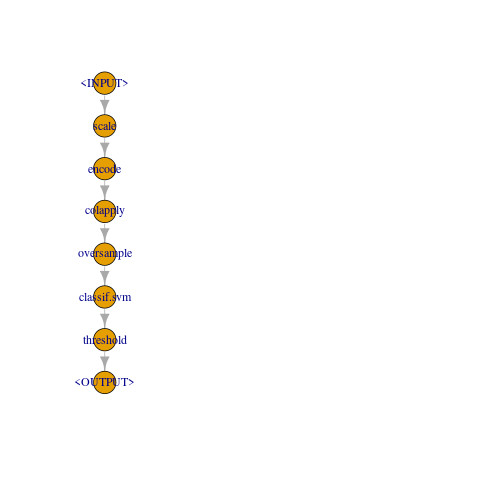
```

**Note**: Using `mlr3pipelines` in combination with `iml`^[https://christophm.github.io/iml/] has the advantage that the interpretation is always done with respect to the original features (e.g., before one-hot encoding). This is because the pipeline fuses data preprocessing and modeling to a single unit. This implies that the model itself is a pipeline.

## Tuning and Benchmarking
We use nested resampling^[https://mlr3book.mlr-org.com/nested-resampling.html] in order to obtain unbiased performance estimates for the different learners. The parameter tuning is done with the following settings for all models. The tuning code is available in the ` Source Code for Benchmarking.R` file in the code repository.
```{r}
# tuning settings
measure <- msr("classif.bacc")
tuner <- tnr("grid_search", resolution = 7L)
inner_cv5 <- rsmp("cv", folds = 5L)
outer_cv3 <- rsmp("cv", folds = 3L)
terminator <- trm("evals", n_evals = 20)
```
As can be seen in the code snippet above, we use the `classif.bacc`, or the _balanced accuracy_ as our tuning performance measure.
The balanced accuracy is used in binary and multi-class classification problems to deal with imbalanced datasets. It is defined as the average of recall obtained on each class [@balanced-accuracy].
$$
\frac{1}{\sum_i \hat w_i}\sum_{i}1(r_i = t_i)\hat w_i
$$
where $\hat w_i = \frac{w_i}{\sum_i 1(y_j = y_i)w_i}$ [@mlr3-balanced-accuracy].\
We use `grid_search` as our hyperparameter tuning algorithm. The number of inner and outer cross-validation folds and terminator evaluations of the nested resampling are set so as to train and be able to evaluate the different models in a reasonable amount of time on limited computing resources.

The code snippet below shows the tuning setup for Xgboost and the radial basis kernel SVM. Please refer to the code in ` Source Code for Benchmarking.R` for the other models tuning configurations.
```{r, eval=FALSE}
# xgboost
xgboost_learner <- po(lrn("classif.xgboost", predict_type="prob"))
xgboost_pipeline <- pos %>>% xgboost_learner
xgboost_glearner <- GraphLearner$new(xgboost_pipeline, id="xg_boost", predict_type = "prob")

xgboost_search_space <- ParamSet$new(list(
  ParamDbl$new("threshold.thresholds", lower = 0, upper = 1),
  ParamDbl$new("classif.xgboost.eta", lower = 0.1, upper = 0.3),
  ParamDbl$new("classif.xgboost.colsample_bytree", lower = 0.5, upper = 0.9),
  ParamInt$new("classif.xgboost.max_depth", lower = 8, upper = 16),
  ParamDbl$new("classif.xgboost.subsample", lower = 0.5, upper = 0.8),
  ParamInt$new("classif.xgboost.nrounds", lower = 110, upper = 118),
  ParamDbl$new("classif.xgboost.gamma", lower = 0, upper = 4),
  ParamDbl$new("classif.xgboost.lambda", lower = 1, upper = 4.5),
  ParamDbl$new("classif.xgboost.alpha", lower = 0, upper = 1)
)
)

# Creating the AutoTuner.
xgboost_at <- AutoTuner$new(
  learner = xgboost_glearner,
  resampling = inner_cv5,
  terminator = terminator,
  search_space = xgboost_search_space,
  tuner = tuner,
  measure = measure
)

# SVM
radial_svm_learner <- lrn("classif.svm",
  type = "C-classification", kernel = "radial",
  predict_type = "prob"
)
radial_svm_pipeline <- pos %>>% radial_svm_learner %>>% threshold
radial_svm_glearner <- GraphLearner$new(radial_svm_pipeline, id = "radial_svm")

radial_svm_search_space <- ParamSet$new(list(
  ParamDbl$new("threshold.thresholds", lower = 0, upper = 1),
  ParamDbl$new("classif.svm.cost", lower = 0.01, upper = 100),
  ParamDbl$new("classif.svm.gamma", lower = 0.0001, upper = 1)
))

radial_svm_at <- AutoTuner$new(
  learner = radial_svm_glearner,
  resampling = inner_cv5,
  terminator = terminator,
  search_space = radial_svm_search_space,
  tuner = tuner,
  measure = measure
)

design <- benchmark_grid(
  task = task,
  learners = list(
    log_reg_at,
    rpart_at,
    ranger_at,
    linear_svm_at,
    poly_svm_at,
    radial_svm_at
  ),
  resamplings = outer_cv3
)
# bmr <- benchmark(design)
```

\newpage
## Result

We use the `F1` score (the harmonic mean of the precision and recall) as an additional measure for comparison with `bacc` in the evaluation of the results.

```{r, eval=FALSE}
autoplot(bmr, measure = msr("classif.bacc")) +
  theme(axis.text.x = element_text(angle = 45, hjust = 1))
autoplot(bmr, measure = msr("classif.fbeta")) +
  theme(axis.text.x = element_text(angle = 45, hjust = 1))
```
```{r evaluation-results-bacc, out.width='70%', fig.align='center', fig.cap="\\label{fig:evalutation-results-bacc}Evaluation using bacc", echo=FALSE}
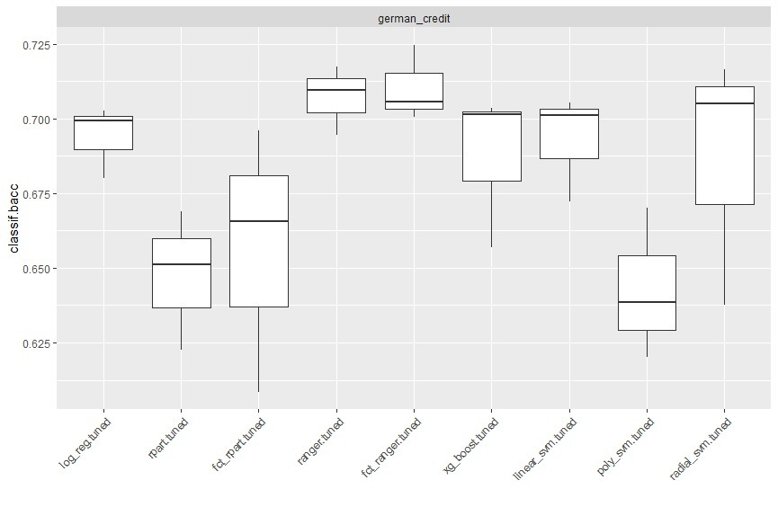
```
```{r evaluation-results-fbeta, out.width='70%', fig.align='center', fig.cap="\\label{fig:evalutation-results-fbeta}Evaluation using F1", echo=FALSE}
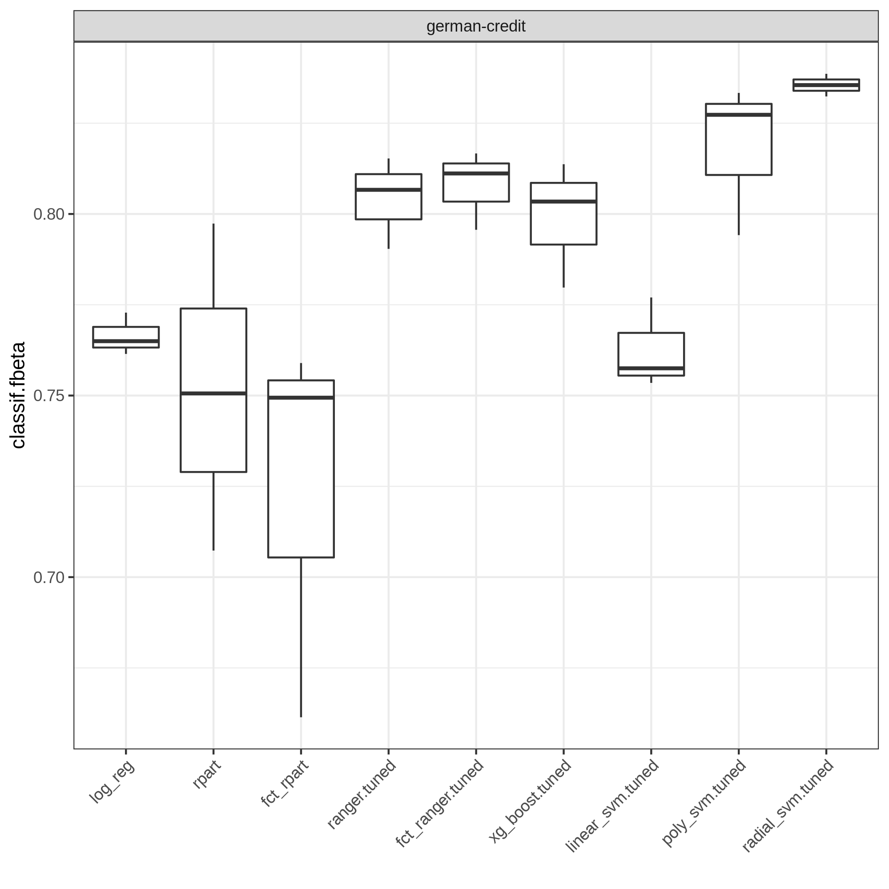
```

| Learner           | (Aggregated) Bacc Score   | Bacc Score Ranking |
|------------------|----------------|-------------|
|    log_reg.tuned |    0.6938901   | 4           |
|      rpart.tuned |    0.6474967   | 8           |
|  fct_rpart.tuned |    0.6567134   | 7           |
|     ranger.tuned |    0.7070398   | 2           |
| fct_ranger.tuned |    0.7102758   | 1           |
|   xg_boost.tuned |    0.6872560   | 6           |
| linear_svm.tuned |    0.6928462   | 5           |
|   poly_svm.tuned |    0.6428362   | 9           |
| radial_svm.tuned |    0.6963865   | 3           |

Table: Bacc Aggregated Benchmark Results


| Learner           | (Aggregated) F1 Score    | F1 Score Ranking |
|------------------|----------------|-------------|
|log_reg.tuned     |   0.7705923    | 4           | 
|rpart.tuned       |   0.7423392    | 7           |
|fct_rpart.tuned   |   0.7440794    | 6           |
|ranger.tuned      |   0.7798829    | 2           |
|fct_ranger.tuned  |   0.7742013    | 3           |
|xg_boost.tuned    |   0.7054896    | 8           |
|linear_svm.tuned  |   0.6906385    | 9           |
|poly_svm.tuned    |   0.7536278    | 5           |
|radial_svm.tuned  |   0.8166631    | 1           |

Table: F1 Aggregated Benchmark Results

As can be seen in Figure \ref{fig:evaluation-results-bacc} and Figure \ref{fig:evaluation-results-fbeta} and the benchmark results tables above, the tuned SVM using radial basis kernel and the random forest models (`ranger` and `fct_ranger`) consistently achieve top performance with respect to both the `bacc` and `F1` measures. We choose the radial kernel SVM, which has the highest aggregated `F1` score and the third highest `bacc` score (also considering that the differences in the top aggregated `bacc` scores are very small). The radial basis SVM model is therefore used for subsequent interpretations. We also observe that the performance of decision tree and random forest does not change much, when categorical variables are not one-hot encoded (See box plots in Figure \ref{fig:evaluation-results-bacc} and Figure \ref{fig:evaluation-results-fbeta} labeled `fct_`).

Finally, we train the chosen SVM model on the whole dataset and proceed to analyzing it using IML methods.
```{r, eval=FALSE}
radial_svm_at$train(task)
```

\newpage
# Interpretable Machine Learning Methods and Hypotheses
We first give a brief description of some interpretable machine learning methods we would use to investigate our hypotheses. The methods are more thoroughly described in the Interpertable Machine Learning book by Christoph Molnar @molnar2019.

## Interpretable Machine Learning Methods
In a non-mathematical manner, Miller defined interpretability as "the degree to which a human can understand the cause of a decision" @miller2018explanation. In the context of machine learning, Kim et al. defined it as "the degree to which a human can consistently predict the model’s result" @NIPS2016_5680522b. This means that a machine learning model is said to have high interpretability if it is easy for humans to reason and comprehend the model's predictions. There are some machine learning models that come naturally with this ability e.g. linear regression, logistic regression, decision tree, etc. With this report, however, we redirect our focus to the set of methods that helps humans comprehend the decisions of even low-interpretability machine learning models. The methods that we present later can help make sense of the effects of features on the final outcome of the model, show the importance of features with respect to the model, show how the features interact with each other, and give (counter-)examples to give insight into the behavior of the model.

### Feature Effects

**Partial Dependence Plot (PDP):** The PDP shows marginal effects one or two features have on the predicted outcome of an ML model. From a PDP, we can observe the relationship between the target (response variable) and a predictor variable, whether it is linear, monotonic or more complex. The PDP is calculated by first defining the value grid for the chosen feature $x$, then for each grid value $v$, it replaces the value of feature $x$ in every data point to $v$ and averages the predictions. One strong assumption for using PDP is that the feature of interest is not correlated with other features.\
The partial dependence function for regression is defined and approximated as:
$$
\hat f_{\vec{x}_S}(\vec{x}_S) = E_{\vec{x}_C}[\hat f(\vec{x}_S, \vec{x}_C)] = \int \hat f(\vec{x}_S, \vec{x}_C)d\mathbb{P}(\vec{x}_C) \approx \sum_{i = 1}^n \hat f (\vec{x}_S, \vec{x}_C^{(i)})
$$
where $\hat f$ is the model, $\vec{x}_S$ are the features for which the partial dependence function should be plotted and $\vec{x}_C$ are the other features, $\vec{x}_C^{(i)}$ are the actual feature values from the dataset, $n$ is the sample size. The approximation for the partial dependence function is calculated using the averages from the training data @molnar2019.\
_Categorical features handling in PDP_: With a categorical feature $x$, its categories are considered as separate values and used like the value grid as mentioned earlier. The outcome will be $k$ numbers, one for each of $k$ categories.

**Individual Conditional Expectation (ICE) plot:** The plot displays one line per instance that shows how instance's prediction changes when a feature changes. This plot is equivalent to the PDP for individual instances @molnar2019.

**Accumulated Local Effects (ALE) Plots:** PDP cannot be trusted when the covariates are strongly correlated. Because of how PDP is calculated, it averages predictions of unlikely instances in the case of strong correlation between features. ALE can counter that effect, in fact, it is a faster and unbiased alternative to PDP. ALE describes how features influence the prediction of an ML model on average. To be specific, with a feature $x$ having (grid) value $v$, ALE shows how predictions change within a small window (interval) of $x$ around $v$ for the data points in that window @molnar2019.\
_Categorical features handling in ALE_: To be calculated, ALE needs to know the order of feature values/categories. Therefore, with (unordered) categorical features, there has to be a way to define that order. A possibility is to order the categories based on their similarity: create a (dis-)similarity matrix between features, apply multidimensional scaling to get one-dimensional distance measure. This is also a thing to keep in mind when interpreting ALE plots of (unordered) categorical feature: it is assumed to have a specific order, and how that order is defined depends on the implementation of algorithms, whether in real life this order makes sense or not.

**Shapley Value:** This is a method to estimate feature contributions to a single prediction compared to the average prediction (over all data instances). The shapley value $\phi_{j}$ of a feature $j$ is interpreted as the feature's contribution to the prediction of a particular instance compared to the average prediction for the dataset. See [@molnar2019] for the mathematical details on estimating the shapley value for a feature.

### Global Feature Importance

**Permutation Feature Importance:** It measures the increase in prediction error after permuting the feature values. The feature importance for a feature $j$ given a data matrix $X$ and a data matrix $X^{perm}$ where the feature is permuted, is calculated as shown below:

$$
FI^{j} = \dfrac{e^{perm}}{e^{orig}}
$$
$$
e^{perm} = 1 - bacc(\vec{y}, \vec{f}(X^{perm}))
$$
$$
e^{orig} = 1 - bacc(\vec{y}, \vec{f}(X))
$$
Here $1-bacc$ is a loss measure based on the $bacc$ score. In this report, we compute feature importance on training data, which measures how much a model relies on each feature for making predictions.

### Feature Interaction

**H-Statistic:** The interaction between two features is defined as the change in the prediction that occurs when varying the features after considering the individual feature effects. A measure of the interaction strength is the H-Statistic. It measures how much of the variation of the prediction depends on the interaction of the features.
In the absence of any interaction effect between two features, the partial dependence function $PD_{jk}(x_{j}, x_{k})$ between two features can be decompose as shown below:
$$
PD_{jk}(x_{j}, x_{k}) = PD_{j}(x_{j}) + PD_{k}(x_{k})
$$
Equivalently, if a feature does not interact with any other feature. The prediction function $\hat{f}(\vec{x})$ can be decomposed as follows:
$$
\hat{f}(\vec{x}) = PD_{j}(x_{j}) + PD_{-j}(\vec{x}_{-j})
$$
where $PD_{-j}(\vec{x}_{-j})$ is the partial dependence function that depends on all features except the j-th feature.

Friedman's H-Statistic can tell us two things:

1. Whether and to what extent two features interact with one-another, computed as:
$$
H^{2}_{jk} = \dfrac{ \sum_{i=1}^{n}\biggl[PD_{jk}(x_{j}^{(i)}, x_{k}^{(i)}) - PD_{j}(x_{j}^{(i)}) - PD_{k}(x_{k}^{(i)})\biggr]^{2}}{\sum_{i=1}^{n}PD^{2}_{jk}(x_{j}^{(i)}, x_{k}^{(i)})}
$$
2. Whether and to what extent a feature interacts with all other features in the model,:
$$
H^{2}_{j} = \dfrac{ \sum_{i=1}^{n}\biggl[\hat{f}(\vec{x}^{(i)}) - PD_{j}(x_{j}^{(i)}) - PD_{-j}(\vec{x}_{-j}^{(i)})\biggr]^{2}}{\sum_{i=1}^{n}\hat{f}(\vec{x}^{(i)})}
$$

### Example-Based Explanations

**Counterfactual Explanations:** A counterfactual explanation of a prediction describes the smallest change to the feature values that changes the prediction to a predefined output. [@molnar2019] describes four criteria to determine the quality of good counterfactual instances:

1. A counterfactual instance produces the predefined prediction as closely as possible.
2. A counterfactual should be as similar as possible to the instance regarding feature values.
3. Multiple diverse counterfactual explanations are often desireable.
4. A counterfactual instance should have feature values that are likely.

In this report, we use the method by [@Dandl_2020] for generating counterfactual explanations. This method takes into account the aforementioned criteria during the counterfactual generating process. See [@Dandl_2020] for the details of this method.


## Story Time and Analysis

The following story is taking place in 1980, just a few years after the dataset was collected. This is because the dataset is not adjusted for inflation to the present date (and was collected in Deutsche Mark), and the amounts would be invalid for the recent years. We therefore also make the further assumption, although very unrealistic but harmless, that the used IML methods were developed and available for application in 1980.

Bob is a 30 year old, senior data scientist in Munich. He has been married for 5 years with no kids. Bob wanted to loan some money for starting his own company. However, after checking his credit, the bank said no to his request.
In contrast, with his best friend, James, the story is different. James is a doctor, the same age as Bob, and he is single. James wanted a loan to purchase a car and got a green light from the bank.

Although Bob is happy for James, he is very frustrated and curious about why the bank made those decisions, eventhough from the first look, his profile seems very good.  So he decides to investigate the problem to gain some insights. but for that purpose,  he needs a dataset. After a few hours of searching, he found the south German credit data set that was used for predicting credit in the banks. And also, as he does not have the exact algorithm, or any kind of machine learning model that the bank uses, he resorted to his own model choice on the dataset. He selected some of the baseline models and some black box models to benchmark to choose a good one. And his final choice is the support vector machine using radial basis kernel. His model performs really well on test data, which reassures him that it can be used in place of the bank’s model. He also applies the model on his case and his friend’s case. The model predicts a `bad` credit risk for him and `good` credit risk for his friend, this decision is in accordance with the bank’s decision that he loans from. This motivates him to understand the model even more, with the aim of improving his credit.

Now, the problem is how to interpret the model as SVM is a blackbox model. To do that, he applied some Interpretable Machine Learning methods and unearthed the characteristics of the model’s decisions. First, he wants to get a general understanding of the model and verifies that its predictions make sense. Second, he would investigate, much like a detective, his and his friend's case (Bob's and Jame's feature instances are shown below).
```{r, include=FALSE}
library("iml")
```
```{r individual-features}
data <- lapply(
  data,
  function(x) if (is.integer(x)) as.numeric(x) else x
)
data <- lapply(
  data,
  function(x) if (is.ordered(x)) factor(x, ordered = FALSE) else x
)
data <- as.data.frame(data)
x <- data[which(names(data) != "credit_risk")]

bob <- x[1, ]
temp <-
  data.frame(
    "age" = 30,
    "amount" = 18424,
    "credit_history" = "no credits taken/all credits paid back duly",
    "duration" = 60, # 5 years
    "employment_duration" = "4 <= ... < 7 yrs",
    "foreign_worker" = "no",
    "housing" = "rent",
    "installment_rate" = "< 20",
    "job" = "manager/self-empl./highly qualif. employee",
    "number_credits" = "1",
    "other_debtors" = "none",
    "other_installment_plans" = "none",
    "people_liable" = "0 to 2",
    "personal_status_sex" = "male : married/widowed",
    "present_residence" = "1 <= ... < 4 yrs",
    "property" = "car or other",
    "purpose" = "business",
    "savings" = "... >= 1000 DM",
    "status" = "... >= 200 DM / salary for at least 1 year",
    "telephone" = "yes (under customer name)"
  )
bob[1, ] <- temp[, colnames(x)]

james <- x[1, ]
temp <-
  data.frame(
    "age" = 30,
    "amount" = 6480, # average car price in the 70s
    "credit_history" = "no credits taken/all credits paid back duly",
    "duration" = 12,
    "employment_duration" = "4 <= ... < 7 yrs",
    "foreign_worker" = "no",
    "housing" = "rent",
    "installment_rate" = "< 20",
    "job" = "skilled employee/official",
    "number_credits" = "2-3",
    "other_debtors" = "none",
    "other_installment_plans" = "bank",
    "people_liable" = "0 to 2",
    "personal_status_sex" = "female : non-single or male : single",
    "present_residence" = "< 1 yr",
    "property" = "unknown / no property",
    "purpose" = "car (new)",
    "savings" = "unknown/no savings account",
    "status" = "... >= 200 DM / salary for at least 1 year",
    "telephone" = "no"
  )
james[1, ] <- temp[, colnames(x)]
```
```{r}
radial_svm_at <- readRDS("tuned_radial.rds")

german <- as.data.frame(task$data())
model <- Predictor$new(radial_svm_at, data = x, y = german$credit_risk)
```

```{r}
predict(radial_svm_at, bob, predict_type = "response")
predict(radial_svm_at, james, predict_type = "response")
```
__Note:__ After tuning, the radial SVM has a probability threshold of 0.5 i.e. being greater or equal to 0.5 is considered as having good credit. This threshold needs to be taken into account when interpreting the prediction probability from IML methods.
```{r}
# Threshold of tuned radial svm.
radial_svm_at$tuning_result$threshold.thresholds
```

To get a general understanding of the model, Bob formulates the following hypotheses together with the IML methods he intends to use.

|Hypothesis|IML Method|
|----------|----------|
|What are the most important features for the prediction of the `credit_risk`?|Permutation Feature Importance|
|How strong is the interaction between each feature and all other features in the German credit Dataset?|H-Statistics|
|Is being older better for `credit_risk`?|PDP, ICE, ALE|
|Is there an interaction between `job` and `credit_history`? People with delayed `credit_history` often have low quality `job`.|H-Statistic|
|People with high quality `job`s have good `credit_risk`.|ALE|
|Being a foreign worker does not affect your `credit_risk`. If this feature is important for prediction, this implies discrimination.|ALE|
|The better the `savings`, the better your `credit_risk`.|ALE|
Table: General Hypotheses

To investigate the individual cases of Bob and his friend, Bobs asks the following questions, together with the IML methods he thinks can help him answer them.

|Hypothesis|IML Method|
|----------|----------|
|What are the feature contributions to James' `credit_risk` prediction ?|SHAP|
|What are the feature contributions to Bob's `credit_risk` prediction ?|SHAP|
|Because Bob is married and James isn't, Bob is interested in whether his marital status has a positive or negative effect on the model's prediction.|SHAP|
|What can Bob do to improve his credit, i.e. to be considered `good` (according to this model)?|Counterfactual Explanations|
Table: Specific Hypotheses

We use the package `iml` to investigate our hypotheses. Again, the following interpretations are performed with respect to the original features (before preprocessing by the pipeline).

### General Hypotheses
1. What are the most important features for the prediction of the `credit_risk`?\
The importance of features can be uncovered using Permutation Feature Importance, where the losses are chosen to be `1 - bacc` and `1 - F1`. These losses are chosen as they align with the measures for optimizing and selecting the best model in the benchmark. Through the increase in the prediction error, we can see that the most important feature for predicting `credit_risk` according to the model is `status` of your checking account, which stands out from the rest, and the second most important feature is `duration`. More details can be seen in Figure \ref{fig:feature-importance-bacc} and Figure \ref{fig:feature-importance-fbeta}.

```{r out.width='80%', fig.align='center', fig.cap="\\label{fig:feature-importance-bacc}German Credit Feature Importance with (1 - bacc) loss", echo=FALSE}
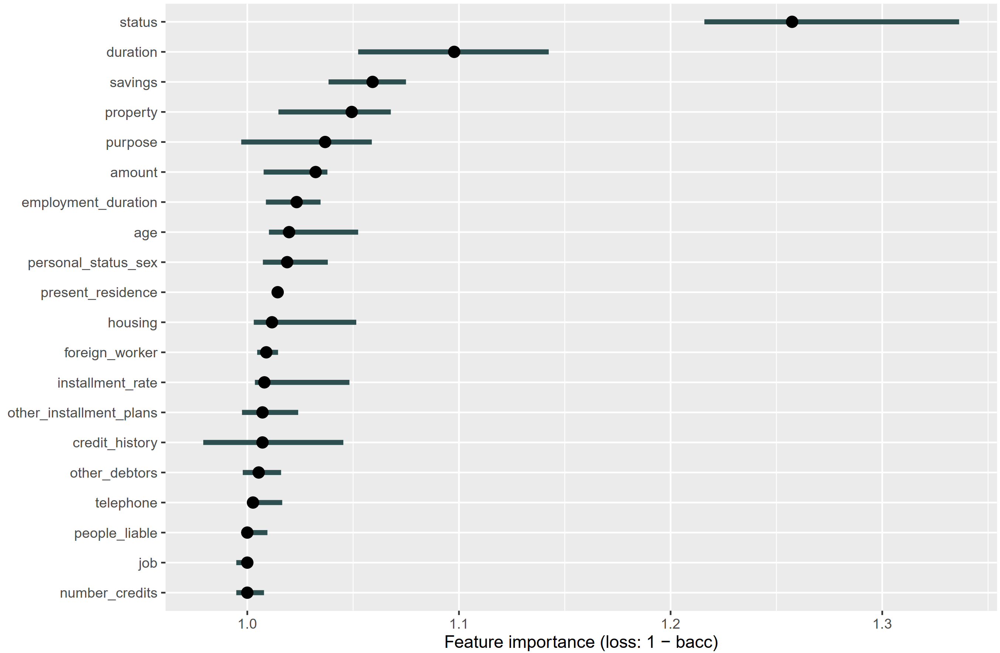
```

```{r out.width='80%', fig.align='center', fig.cap="\\label{fig:feature-importance-fbeta}German Credit Feature Importance with (1 - F1) loss", echo=FALSE}
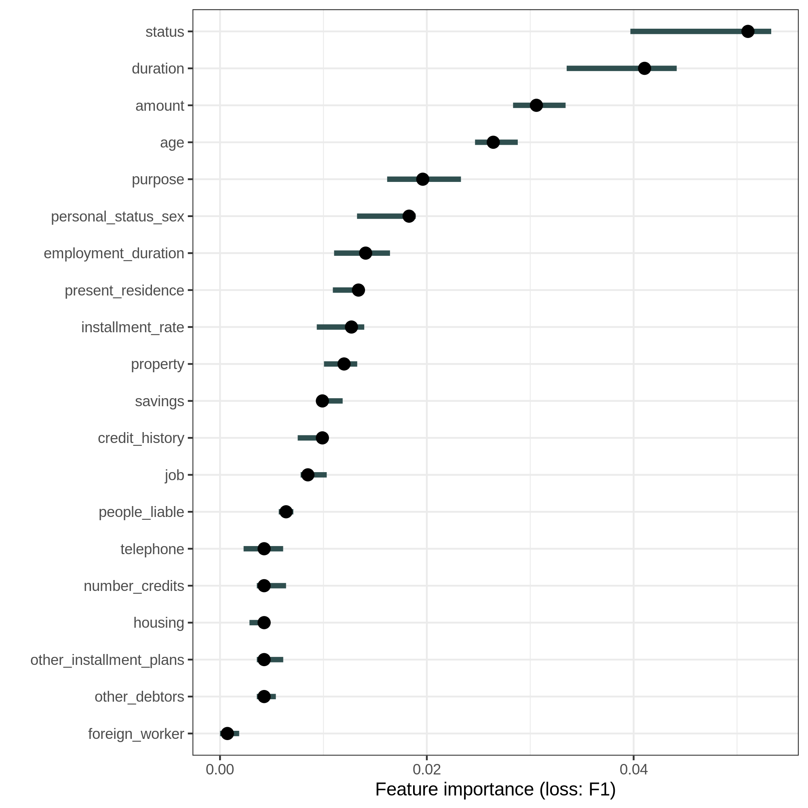
```

2. How strong is the interaction between each feature and all other features in German credit dataset?\
To answer the question, we calculate the H-statistic between each feature and all other features. The result is presented in Figure \ref{fig:interaction}. As can be seen, the interactions are very weak. The interactions only explain less than 5% variance in most of the features. The highest interaction strength is with the feature `status` where approximately 17.5% of variance is explained.

```{r out.width='80%', fig.align='center', fig.cap="\\label{fig:interaction}Interaction Strength (H-Statistic) between each feature and all other features", echo=FALSE}
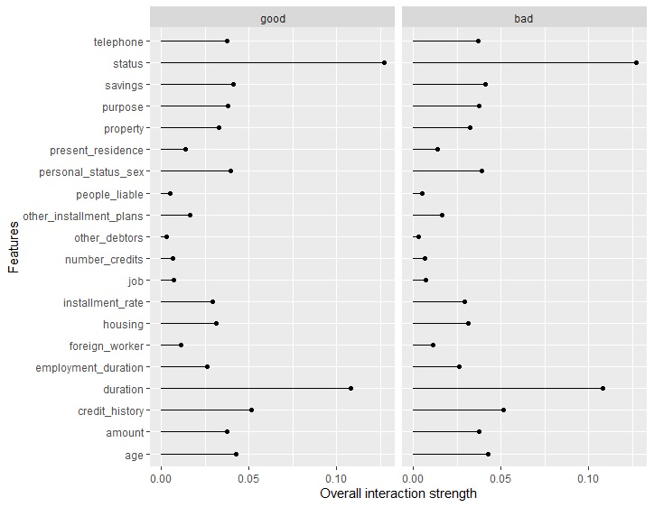
```

3. Is being older better for `credit_risk`?\
To answer this question, we use the PDP + ICE (centered + uncentered) and ALE plot (Figures \ref{fig:pdp-ice-age}, \ref{fig:pdp-ice-center-age}, \ref{fig:ale-age}). From the three plots, it can be seen that there is a consistent linear relation between the predicted probability and `age`: The higher the age, the better the `good` credit probability. With the ALE plot, we can also observe more clearly the effect of the individual feature `age` on the average prediction: age before 35 has negative effect on the credit score.

```{r pdp-ice-age, out.width='100%', fig.align='center', fig.cap="\\label{pdp-ice-age}Uncentered PDP + ICE Plot of `age'", echo=FALSE}
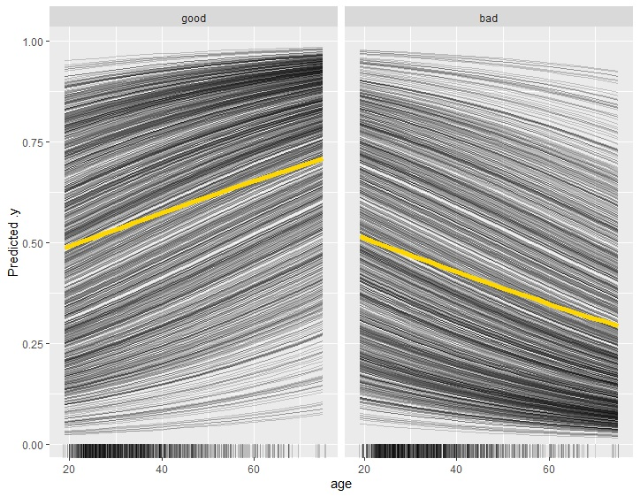
```

```{r pdp-ice-center-age, out.width='100%', fig.align='center', fig.cap="\\label{pdp-ice-center-age}Centered PDP + ICE Plot of `age'", echo=FALSE}
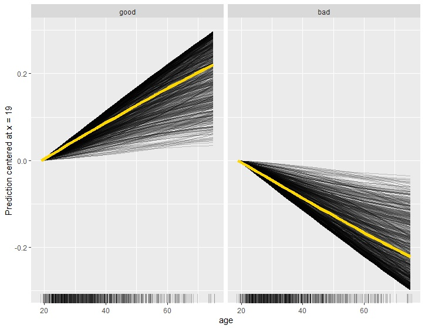
```

```{r ale-age, out.width='100%', fig.align='center', fig.cap="\\label{ale-age}ALE Plot of `age'", echo=FALSE}
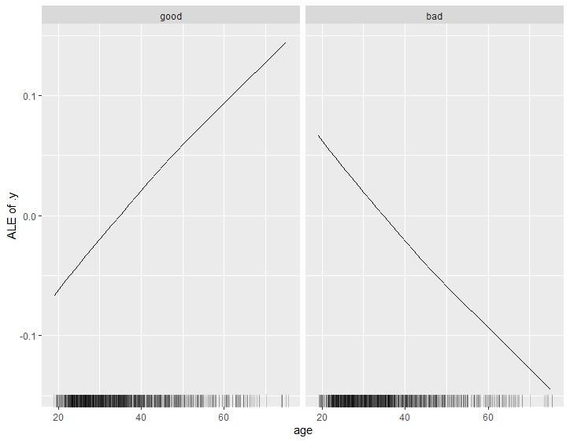
```

4. Is there an interaction between `job` and `credit_history`? People with delayed `credit_history` often have low quality `job`.\
Figure \ref{fig:job-interaction} shows the 2-way interactions between job and the other features. The interaction strength between `job` and `credit_history` is pretty weak. In general all the 2-way interactions between `job` and other features are pretty weak.

```{r job-interaction, out.width='80%', fig.align='center', fig.cap="\\label{job-interaction}2-way interaction strength between `job' and  the other features.", echo=FALSE}
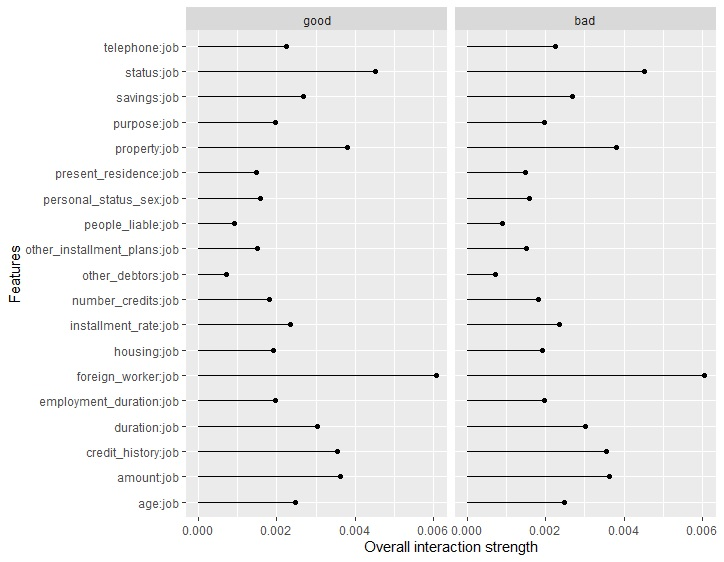
```

5. People with high quality `job`s have good `credit_risk`.\
ALE plot continues to be used to answer this question (Figure \ref{fig:ale-job}). Here, the `job`'s categories are ordered based on their similarity to each other, based on the distributions of the other features by `job`'s category. This order makes real-life sense, e.g. high-qualified job is similar to skilled job and dissimilar to unskilled/unemployment job. According to the plot, being unskilled and non-resident or being manager/high qualified employee causes a loss in your credit score while being skilled employees or just being a resident can have a positive effect on your credit score. This raises some questions for us to think about. Why are both unskilled but being resident has good effect on the credit and bad effect otherwise? Is it some kind of discrimination to foreigners? The plot also shows that being a high-qualified employee has the worst effect on the credit, which is an absurd thing. These may be explained due to the fact that the dataset is relatively small so it may possess high variance.

```{r out.width='100%', fig.align='center', fig.cap="\\label{fig:ale-job}ALE Plot of `job'", echo=FALSE}
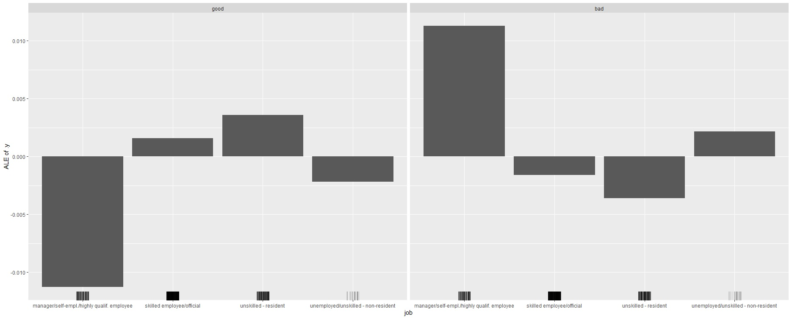
```

6. Being a foreign worker does not affect your credit risk. If this feature is important for prediction, this implies discrimination.\
As can be seen from Figure \ref{fig:feature-importance-bacc} and Figure \ref{fig:feature-importance-fbeta}, `foreign_worker` is the 9th least important feature in 20 features in total, respectively. Looking at the ALE plot for `foreign_worker` in Figure \ref{fig:ale-foreign-worker}, we notice a strange phenomenon. If you are a foreign worker, it brings positive effect to your credit, and otherwise, a slight negative effect. However, this can be explained by the distribution of the feature (Figure \ref{fig:geom-bar-foreign-worker}). The proportion of foreign workers is less than 4% the proportion of native workers (37 to 963) and almost 90% of the foreign workers in the dataset has good credit however only about 70% of the native workers in the dataset has good credit.

```{r}
summary(data$foreign_worker)
```

```{r ale-foreign-worker, out.width='100%', fig.align='center', fig.cap="\\label{ale-foreign-worker}ALE Plot for `foreign-worker'", echo=FALSE}
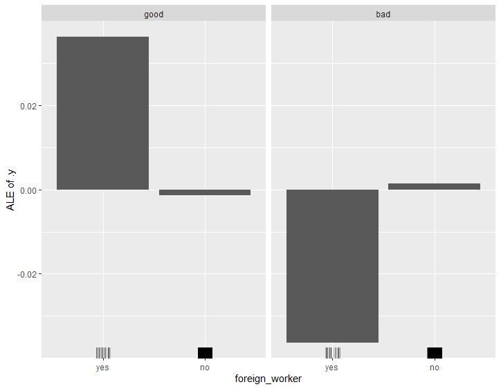
```

```{r, eval=FALSE}
ggplot(data = data, mapping = aes(x = foreign_worker, fill = credit_risk)) +
  geom_bar()
```
```{r geom-bar-foreign-worker, out.width='70%', fig.align='center', fig.cap="\\label{geom-bar-foreign-worker}Bar Plot for `foreign-worker' with distribution of `credit-risk' in each level", echo=FALSE}
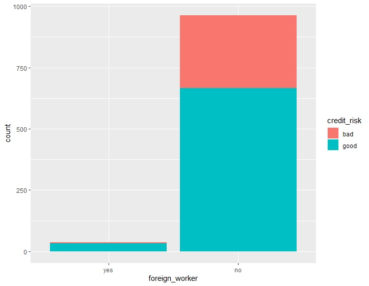
```

7. The better the savings, the better your credit risk.\
We continue to use ALE plot to answer this question. Looking at the plot in Figure \ref{fig:ale-savings}, it is clear that the more money for savings, the more positive effect it has on your credit risk. And if there is no savings account, the credit can suffer.

```{r ale-savings, out.width='100%', fig.align='center', fig.cap="\\label{ale-savings}ALE Plot for `savings'", echo=FALSE}
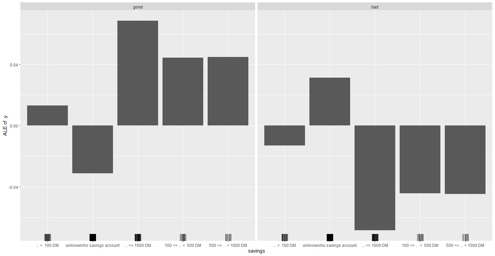
```


### Bob and James-specific Hypotheses

1. What are the feature contributions to James’
credit_risk prediction ? \
Figure \ref{fig:shapley-james} shows that the most influential features affecting james's good prediction are his checking account's `status` and the `duration` (one year) of his credit, compared to the average prediction for the data set.

```{r, eval=FALSE}
shapley <- Shapley$new(model, x.interest = james)
```
```{r shapley-james, out.width='100%', fig.align='center', fig.cap="\\label{shapley-james}Shapley contributions to James's predictions", echo=FALSE}
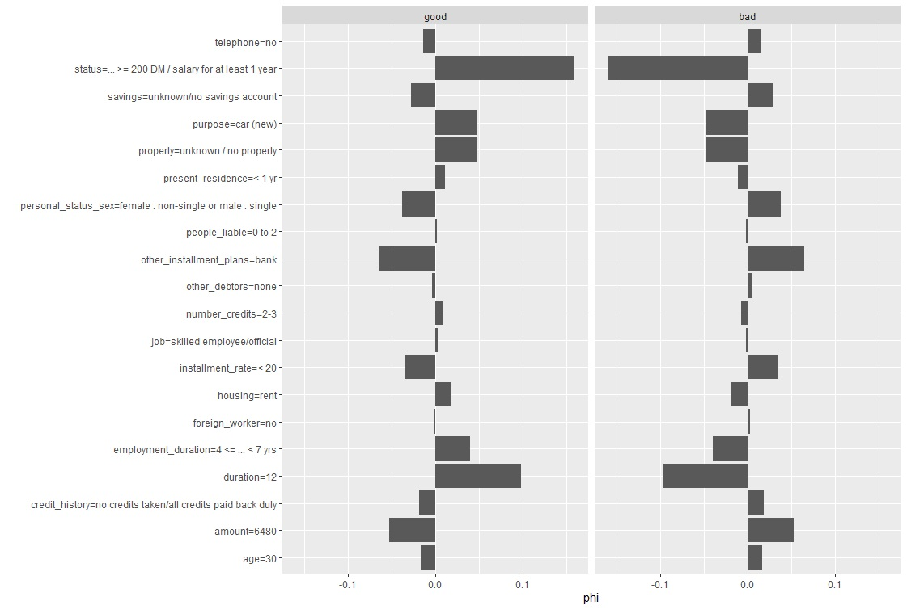
```
2. What are the feature contributions to Bob’
credit_risk prediction ? \
Figure \ref{fig:shapley-bob} shows that the most influential features affecting Bob's bad prediction are his requested credit `amount` and the credit `duration` compared to the average prediction for the data set. Bob is requesting a fairly large amount of `18424 DM` to pay in `5 years`. This value is in fact the maximum amount in the observed dataset.

```{r, eval=FALSE}
shapley <- Shapley$new(model, x.interest = bob)
```
```{r}
max(data$amount)
```
```{r shapley-bob, out.width='100%', fig.align='center', fig.cap="\\label{shapley-bob}Shapley contributions to Bob's predictions", echo=FALSE}
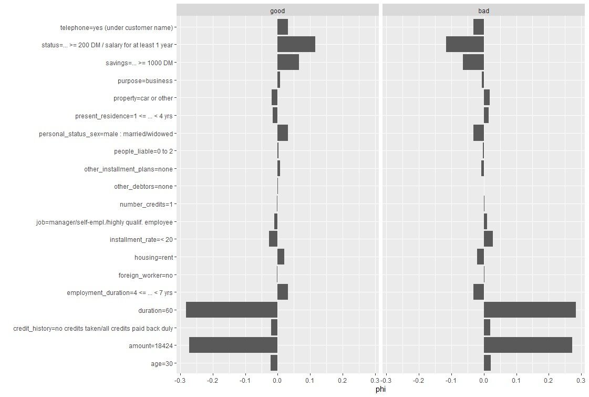
```

3. Because Bob is married and James isn't, Bob is interested in whether his marital status has a positive or negative effect on the model's prediction. \
Both Figure \ref{fig:shapley-james} and Figure \ref{fig:shapley-bob} show that although the contribution of status is fairly small, the fact that James is single actually has a negative contribution to his `good` `credit_risk`, while the fact that bob is married has a positive contribution to his `credit_risk`.

```{r, eval=FALSE, include=FALSE}
# counterfactuals
devtools::load_all("../counterfactuals", export_all = FALSE)
# generated by irace in folder appendix_irace
best_params <- readRDS("../best_configs.rds")
```


4. What can Bob do to improve his credit, i.e. to be considered `good` (according to this model)? \
To help Bob, we use the counterfactual explanations to see if there is any combination of changes that can be proposed to mitigate Bob's predicted `credit_risk`. The counterfactuals are presented in Table \ref{tab:counterfactual-diff-results}. In this table, we filter out instances having changing values on features such as `age` and `foreign_worker` status as it is not realistic to change that (generally, instances with unrealistic feature values are manually filtered out). Also, a lot of other features are filtered out from the final counterfactuals table as they are unchanged. We also only consider the counterfactuals that have probability greater than 0.5 (which is the threshold for good `credit_risk`). As a result, the features that need to be changed the most to help improve Bob's credit is `duration` and `amount`, where `amount` was changed almost in all of the counterfactuals (97%), followed by `duration` (63%). To be specific, if Bob reduced the credit amount he loans or reduced the credit duration or both, while keeping other elements (other covariates of the model) fixed, the model would predict a better `credit_risk` for him. A detailed look into the effect of these two features on Bob's credit probability are given in Figure \ref{fig:counterfactuals-surface-bob}, which confirms why the changes in these features are recommended by the model.

```{r, eval=FALSE, include=FALSE}
cf <- Counterfactuals$new(
  predictor = model,
  x.interest = bob,
  lower = 0,
  epsilon = 0,
  target = c(0.5, 1),
  generations = list(
    mosmafs::mosmafsTermStagnationHV(10),
    mosmafs::mosmafsTermGenerations(200)
  ),
  mu = best_params$mu,
  p.mut = best_params$p.mut,
  p.rec = best_params$p.rec,
  p.mut.gen = best_params$p.mut.gen,
  p.mut.use.orig = best_params$p.mut.use.orig,
  p.rec.gen = best_params$p.rec.gen,
  initialization = "icecurve",
  p.rec.use.orig = best_params$p.rec.use.orig,
)

# retrieve the counterfactuals of Bob
cf_diff <- cf$results$counterfactuals.diff
# filter only the counterfactuals with prediction greater than 0.51
cf_result_diff <- cf_diff[cf_diff$pred.pred >= 0.51, ]
cf_result_diff <- cf_result_diff[order(-cf_result_diff$pred.pred), ]
# filter features that are not meaningful for the counterfactuals interpretation
cf_result_diff <- cf_result_diff[cf_result_diff$age == 0, ]
cf_result_diff <- cf_result_diff[cf_result_diff$foreign_worker == 0, ]
cf_result_diff <- subset(cf_result_diff,
  select = -c(
    dist.target,
    dist.x.interest,
    dist.train,
    pred.NA,
    credit_history,
    age,
    foreign_worker,
    employment_duration,
    installment_rate,
    personal_status_sex,
    other_debtors,
    property,
    other_installment_plans,
    housing,
    number_credits,
    telephone,
    present_residence,
    people_liable,
    nr.changed,
    status,
    job
  )
)
```

```{r counterfactual-diff-results, echo=FALSE, warning=FALSE, results="asis"}
library(kableExtra)
cf_result_diff <- read.csv("cf_result_diff.csv",
  sep = "\t", header = T,
  row.names = NULL
)
for (col in c(2, 4, 5)) {
  cf_result_diff[, col] <- gsub("/", "/ ", cf_result_diff[, col])
}

knitr::kable(cf_result_diff,
  "latex",
  digits = 2,
  caption = "Counterfactuals from Bob's case"
) %>%
  column_spec(1:5, width = "8em")
```

```{r}
# Percentage of counterfactuals that changes `amount`
nrow(cf_result_diff[cf_result_diff$amount != 0,])/nrow(cf_result_diff)
# Percentage of counterfactuals that changes`duration`
nrow(cf_result_diff[cf_result_diff$duration != 0,])/nrow(cf_result_diff)
```

```{r, eval=FALSE}
cf_surface <- cf$plot_surface(features = c("duration", "amount"))
cf_surface
```

```{r counterfactuals-surface-bob, out.width='80%', fig.align='center', fig.cap="\\label{counterfactuals-surface-bob}Counterfactuals surface plot of two features `duration' and `amount' of Bob's case", echo=FALSE}
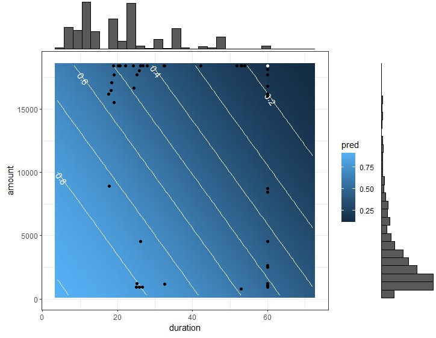
```

\newpage
# Conclusion
In this paper, we have investigated different interpretable machine learning methods, to explain the prediction of a chosen model.
We used the south German credit dataset collected in the 1970s. The goal of modeling with this dataset is to classify people by their credit risk (good or bad) using 20 features. Our model of choice was a radial basis kernel support vector machine. The motivation for this blackbox model is discussed in Chapter [2](#model-selection). To get some insights into this model's predictions, a short story was created around two characters (Bob, the protagonist and his friend James) and some hypotheses were formulated around this story, which are then investigated using some interpretable machine learning techniques (See Chapter [3](#interpretable-machine-learning-methods-and-hypotheses)). 

We observe among others that according to the model trained for the analysis of the different hypotheses, generally the two most important features for predicting credit risk are the checking account `status` and the loan `duration`. Also, it was observed that `age` has a linearly increasing effect on the predicted credit risk, i.e., the higher the age, the better the credit risk. Furthermore, the better a person's `savings`, the better the credit prediction. The general interaction strength between a feature and the other features and pretty weak. The interpretation of the effect of the `job` quality was observed to be counterintuitive, as the high quality managing job, had a negative effect on the model prediction, this might be an issue associated with the small dataset size. Additionally although being a foreign worker is not a very important feature for the model's prediction, we observe that it has a positive effect on the model's prediction. See Section [3.2.1](#general-hypotheses) for a more in-depth analysis of these observations.

On a more specific note, we discovered that, what accounted for Bob's `bad` credit risk prediction were the `amount` he asked, which is fairly large and the credit `duration` of 5 years, compared to James (who has a `good` credit risk prediction) 1 year credit duration. Furthermore, we noticed that being married was not the reason for Bob's `bad` credit risk prediction. To improve Bob's credit risk, we conclude after analysis with counterfactual instances for this particular trained model, that Bob should reduce the credit `amount` and/or the credit `duration` accordingly (Table \ref{tab:counterfactual-diff-results}).
\newpage

# Source Code
All of the source code we use for benchmarking and perform interpretation is accessible through this ___[Google Drive link](https://drive.google.com/drive/folders/1Md1GLWYInr4QH7axTwzSn7H0KF-jcUSL?usp=sharing)___.

# References
