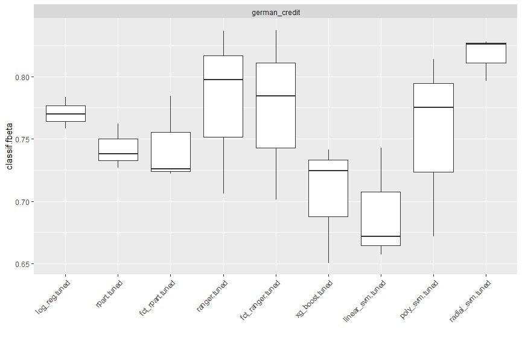

```{r setup, include=FALSE}
knitr::opts_chunk$set(echo = TRUE)
```
\newpage

# Dataset
For the Seminar we use the South German Credit dataset, available in the UCI Machine learning repository^[https://archive.ics.uci.edu/ml/datasets/South+German+Credit+%28UPDATE%29].

The dataset consists of a 1000 observations together with 21 attributes. The data was collected between 1973 and 1975. The task associated with this data set is the classification of individuals (instances) according to their credit risk ("good", "bad").


| Attribute | Description                 |
| --------- |-----------------------------|
| status | Status of the debtor's checking account with the bank\
(factor with 4 levels: _"no checking account"_, _"... < 0 DM"_,\
_"0<= ... < 200 DM"_, _"... >= 200 DM / salary for at least 1 year"_) |
| duration | Credit duration in months (int) |
| credit_history | History of the compliance with previous or current credit contracts\
(factor with 5 levels: _"delay in paying off in the past"_,\
_"critical account/other credits elsewhere"_, _"no credits taken/all credits paid back duly"_,\
_"existing credits paid back duly till now"_, _"all credits at this bank paid back duly"_) |
| purpose| Purpose for which the credit is needed\
(factor with 11 levels: _"others"_, _"car (new)"_, _"car (used)"_, _"furniture/equipment"_,\
_"radio/television"_, _"domestic appliances"_, _"repairs"_, _"education"_,\
_"vacation"_, _"retraining"_, _"business"_) |
| amount| Amount in DM (int) |
| savings| Debtor's savings\
(factor with 5 levels:  _"unknown/no savings account"_, _"... <  100 DM"_,\
_"100 <= ... <  500 DM"_, _"500 <= ... < 1000 DM"_, _"... >= 1000 DM"_) |
| employment_duration| Duration of debtor's employment with current employer\
(factor with 5 levels: _"unemployed"_, _"< 1 yr"_, _"1 <= ... < 4 yrs"_,\
_"4 <= ... < 7 yrs"_, _">= 7 yrs"_) |
| installment_rate| Credit installments as a percentage of debtor's disposable income\
(ordered factor with 4 levels: _">= 35"_ < _"25 <= ... < 35"_ < _"20 <= ... < 25"_ < _"< 20"_) |
| personal_status_sex | Combined information on sex and marital status\
(factor with 4 levels: _"male : divorced/separated"_, _"female : non-single or male : single"_,\
_"male : married/widowed"_, _"female : single"_) |
| other_debtors | Is there another debtor or a guarantor for the credit?\
(factor with 3 levels: _"none"_, _"co-applicant"_, _"guarantor"_) |
| present_residence| Length of time (in years) the debtor lives in the present residence\
(ordered factor with 4 levels: _"< 1 yr"_ < _"1 <= ... < 4 yrs"_ \
< _"4 <= ... < 7 yrs"_ < _">= 7 yrs"_) |
| property | The debtor's most valuable property\
(factor with 4 levels: _"unknown / no property"_, _"car or other"_,\
_"building soc. savings agr./life insurance"_, _"real estate"_) |
| age | Age in years (int) |
| other_installment_plans | Installment plans from providers other than the credit-giving bank\
(factor with 3 levels: _"bank"_, _"stores"_, _"none"_) |
| housing | Type of housing the debtor lives in\
(factor with 3 levels: _"for free"_, _"rent"_, _"own"_) |
| number_credits | Number of credits including the current one the debtor has (or had) at this bank\
(ordered factor with 4 levels: _"1"_ < _"2-3"_ < _"4-5"_ < _">= 6"_) |
| job | Quality of debtor's job\
(factor with 4 levels: _"unemployed/unskilled - non-resident"_, _"unskilled - resident"_,\
_"skilled employee/official"_, _"manager/self-empl./highly qualif. employee"_) |
| people_liable | Number of persons who financially depend on the debtor (i.e., are entitled to maintenance)\
(factor with 2 levels: _"3 or more"_, _"0 to 2"_) |
| telephone | Is there a telephone landline registered on the debtor's name?\
(factor with 2 levels: _"no"_, _"yes (under customer name)"_) |
| foreign_worker | Is the debtor a foreign worker?\
(factor with 2 levels: _"yes"_, _"no"_) |
| credit_risk | Has the credit contract been complied with (good) or not (bad)?\
(factor with 2 levels: _"bad"_, _"good"_) |

Table: Dataset

\newpage
## Dataset Summary
```{r, include=FALSE}
# Load necessary libraries
library("mlr3verse")
library("ggplot2")

theme_set(theme_bw())

set.seed(20211301)
lgr::get_logger("mlr3")$set_threshold("error")
```

```{r}
load("south-german-credit.Rda")
task <- TaskClassif$new("german-credit",
  backend = data,
  target = "credit_risk",
  positive = "good"
)
task$col_roles$stratum <- "credit_risk"
```

```{r warning=FALSE, results='hold', echo=FALSE}
skimr::skim_without_charts(data)
```
The data set doesn't have any missing values and requires little preprocessing to fit our model. It can also be pointed out that the data has class-imbalance problem: The number of "good" credited people is more than twice the number of "bad" credited people (700 to 300), as seen in the data set summary above.

# Fitting some models
The `mlr3` package and other packages from the `mlr3` ecosystem are used to do the modeling.
The fitted and tuned models are:

- Logistic Regression
- Decision Tree
- Random Forest
- Xgboost
- Support Vector machines (with linear, polynomial, and radial kernels)

, in which, logistic regression and decision tree are considered as explainable baseline models; random forest, Xgboost and support vector machines with multiple kernel types as blackbox models.

For preprocessing, we do the following:

- Standardize numerical variables by centering them around their mean and scaling them by their root-mean-square.
- One-hot encode factor and ordered-factor variables.
- To account for the class imbalance in the data set, we perform oversampling of the minority class ("bad" class).
```{r}
# PipeOps
fencoder <- po("encode",
  method = "one-hot",
  affect_columns = selector_type("factor")
)
ord_to_num <- po("colapply",
  applicator = as.numeric,
  affect_columns = selector_type(c("ordered", "integer"))
)

int_to_num <- po("colapply",
  applicator = as.numeric,
  affect_columns = selector_type("integer")
)

encoder <- fencoder %>>% ord_to_num

po_over <- po("classbalancing",
  id = "oversample", adjust = "minor",
  reference = "minor", shuffle = FALSE, ratio = 2.3
)
threshold <- po("threshold")
pos <- po("scale") %>>%
  encoder %>>% po_over
```
## Tuning and Benchmarking
The parameter tuning is done with the following settings for all models. The tuning code is available in the `.Rmd` source file.
```{r}
# tuning settings
inner_cv5 <- rsmp("cv", folds = 5L)
measure <- msr("classif.fbeta")
tuner <- tnr("random_search")
terminator <- trm("evals", n_evals = 40)
```

```{r, eval=FALSE}
# Logistic regression
log_reg_learner <- lrn("classif.log_reg", predict_type = "prob")
log_reg_pipeline <- pos %>>% log_reg_learner %>>% threshold
log_reg_glearner <- GraphLearner$new(log_reg_pipeline, id = "log_reg")

log_reg_at <- AutoTuner$new(
  learner = log_reg_glearner,
  resampling = inner_cv5,
  measure = measure,
  search_space = ParamSet$new(list(ParamDbl$new(
    "threshold.thresholds",
    lower = 0,
    upper = 1
  ))),
  terminator = terminator,
  tuner = tuner
)

# Regression trees
rpart_learner <- lrn("classif.rpart", predict_type = "prob")
rpart_pipeline <- pos %>>% rpart_learner %>>% threshold
rpart_glearner <- GraphLearner$new(rpart_pipeline, id = "rpart")

rpart_at <- AutoTuner$new(
  learner = rpart_glearner,
  resampling = inner_cv5,
  measure = measure,
  search_space = ParamSet$new(list(ParamDbl$new(
    "threshold.thresholds",
    lower = 0,
    upper = 1
  ))),
  terminator = terminator,
  tuner = tuner
)

fct_rpart_pipeline <- int_to_num %>>%
  po_over %>>%
  rpart_learner %>>%
  po("threshold")
fct_rpart_glearner <- GraphLearner$new(fct_rpart_pipeline, id = "fct_rpart")

fct_rpart_at <- AutoTuner$new(
  learner = fct_rpart_glearner,
  resampling = inner_cv5,
  measure = measure,
  search_space = ParamSet$new(list(ParamDbl$new(
    "threshold.thresholds",
    lower = 0,
    upper = 1
  ))),
  terminator = terminator,
  tuner = tuner
)

# Random forest
ranger_pipeline <- pos %>>% lrn("classif.ranger",
  predict_type = "prob"
) %>>% threshold
ranger_glearner <- GraphLearner$new(ranger_pipeline, id = "ranger")

ranger_tune_ps <- ParamSet$new(list(
  ParamDbl$new("threshold.thresholds", lower = 0, upper = 1),
  ParamInt$new("classif.ranger.num.trees",
    lower = 100, upper = 140
  ), # number of trees
  ParamInt$new("classif.ranger.mtry",
    lower = 1, upper = ceiling(task$ncol / 2)
  ), # number of variables to possibly split at in each node
  ParamInt$new("classif.ranger.max.depth",
    lower = 2, upper = 20
  ) # maximum depth of the tree
))

ranger_at <- AutoTuner$new(
  learner = ranger_glearner,
  resampling = inner_cv5,
  measure = measure,
  search_space = ranger_tune_ps,
  terminator = terminator,
  tuner = tuner
)

fct_ranger_pipeline <- int_to_num %>>%
  po_over %>>%
  lrn("classif.ranger", predict_type = "prob") %>>%
  po("threshold")
fct_ranger_glearner <- GraphLearner$new(fct_ranger_pipeline, id = "fct_ranger")

fct_ranger_at <- AutoTuner$new(
  learner = fct_ranger_glearner,
  resampling = inner_cv5,
  measure = measure,
  search_space = ranger_tune_ps,
  terminator = terminator,
  tuner = tuner
)

xgboost_learner <- po(lrn("classif.xgboost", predict_type="prob"))
xgboost_pipeline <- pos %>>% xgboost_learner
xgboost_glearner <- GraphLearner$new(xgboost_pipeline, id="xg_boost", predict_type = "prob")

xgboost_search_space <- ParamSet$new(list(
  ParamDbl$new("classif.xgboost.eta", lower = 0.1, upper = 0.3),
  ParamDbl$new("classif.xgboost.colsample_bytree", lower = 0.5, upper = 0.9),
  ParamInt$new("classif.xgboost.max_depth", lower = 8, upper = 16),
  ParamDbl$new("classif.xgboost.subsample", lower = 0.5, upper = 0.8),
  ParamInt$new("classif.xgboost.nrounds", lower = 110, upper = 118),
  ParamDbl$new("classif.xgboost.gamma", lower = 0, upper = 4),
  ParamDbl$new("classif.xgboost.lambda", lower = 1, upper = 4.5),
  ParamDbl$new("classif.xgboost.alpha", lower = 0, upper = 1)
)
)

# Creating the AutoTuner.
xgboost_at <- AutoTuner$new(
  learner = xgboost_glearner,
  resampling = inner_cv5,
  terminator = terminator,
  search_space = xgboost_search_space,
  tuner = tuner,
  measure = measure
)

# Svms
linear_svm_learner <- lrn("classif.svm",
  type = "C-classification", kernel = "linear",
  predict_type = "prob"
)
poly_svm_learner <- lrn("classif.svm",
  type = "C-classification", kernel = "polynomial",
  predict_type = "prob"
)
radial_svm_learner <- lrn("classif.svm",
  type = "C-classification", kernel = "radial",
  predict_type = "prob"
)

# Pipelines
linear_svm_pipeline <- pos %>>% linear_svm_learner %>>% threshold
poly_svm_pipeline <- pos %>>% poly_svm_learner %>>% threshold
radial_svm_pipeline <- pos %>>% radial_svm_learner %>>% threshold

# Learners
linear_svm_glearner <- GraphLearner$new(linear_svm_pipeline, id = "linear_svm")
poly_svm_glearner <- GraphLearner$new(poly_svm_pipeline, id = "poly_svm")
radial_svm_glearner <- GraphLearner$new(radial_svm_pipeline, id = "radial_svm")

# Search spaces
poly_svm_search_space <- ParamSet$new(list(
  ParamDbl$new("threshold.thresholds", lower = 0, upper = 1),
  ParamDbl$new("classif.svm.cost", lower = 0.01, upper = 100),
  ParamDbl$new("classif.svm.gamma", lower = 0.0001, upper = 1),
  ParamInt$new("classif.svm.degree", lower = 1, upper = 4)
))

radial_svm_search_space <- ParamSet$new(list(
  ParamDbl$new("threshold.thresholds", lower = 0, upper = 1),
  ParamDbl$new("classif.svm.cost", lower = 0.01, upper = 100),
  ParamDbl$new("classif.svm.gamma", lower = 0.0001, upper = 1)
))

linear_svm_search_space <- ParamSet$new(list(
  ParamDbl$new("threshold.thresholds", lower = 0, upper = 1),
  ParamDbl$new("classif.svm.cost", lower = 0.01, upper = 100)
))

linear_svm_at <- AutoTuner$new(
  learner = linear_svm_glearner,
  resampling = inner_cv5,
  terminator = terminator,
  search_space = linear_svm_search_space,
  tuner = tuner,
  measure = measure
)
poly_svm_at <- AutoTuner$new(
  learner = poly_svm_glearner,
  resampling = inner_cv5,
  terminator = terminator,
  search_space = poly_svm_search_space,
  tuner = tuner,
  measure = measure
)
radial_svm_at <- AutoTuner$new(
  learner = radial_svm_glearner,
  resampling = inner_cv5,
  terminator = terminator,
  search_space = radial_svm_search_space,
  tuner = tuner,
  measure = measure
)
```
```{r, include=FALSE, eval=FALSE}
outer_cv3 <- rsmp("cv", folds = 3L)
design <- benchmark_grid(
  task = task,
  learners = list(
    log_reg_at,
    rpart_at,
    ranger_at,
    linear_svm_at,
    poly_svm_at,
    radial_svm_at
  ),
  resamplings = outer_cv3
)
bmr <- benchmark(design)
```

```{r, eval=FALSE}
autoplot(bmr, measure = msr("classif.fbeta")) +
  theme(axis.text.x = element_text(angle = 45, hjust = 1))
```
```{r evaluation-results, out.width='70%', fig.align='center', fig.cap="\\label{fig:evalutation-results}Evaluation", echo=FALSE}

```

As can be seen in Figure \ref{fig:evaluation-results}, the tuned SVM using radial basis kernel has the best performance (highest F1 score) and therefore is used for subsequent interpretations. We also observe that the performance of decision tree and random forest does not change much, when categorical variables are not converted to numerics (See box plots in Figure \ref{fig:evaluation-results} labeled `fct_`).

\newpage
# Interpretable Machine Learning Methods and Hypotheses
We first give a brief description of some interpretable machine learning methods we would use to investigate our hypotheses. The methods are more thoroughly described in the Interpertable Machine Learning book^[https://christophm.github.io/interpretable-ml-book/].

## Interpretable Machine Learning Methods

### Feature Effects

**Partial Dependence Plot (PDP):** The plot shows effect one or two features have on the predicted outcome of an ML model.

**Individual Conditional Expectation (ICE) plot:** The plot displays one line per instance that shows how instance's prediction changes when a feature changes. This plot is equivalent to the DPD for individual instances.

**Accumulated Local Effects (ALE) Plots:** A faster and unbiased alternative to PDP. ALE describes how features influence the prediction of an ML model on average. It calculates the differences in predictions instead of averages.

**SHAP Dependence Plots:** An alternative to PDP to visualize feature effects on the model output.

**SHAP Summary Plots:** Visualizes feature importance and effects in a single plot.

### Global Feature Importance

**Permutation Feature Importance:** It measures the increase in prediction error after permuting the feature values.

### Feature Interaction

**H-Statistic:** Friedman's H-Statistic can tell us two things. (1) Whether and to what extent a feature interacts with all other features in the model and (2) whether and to what extent two features interact with one-another.

### Local Interpretation Methods

**Local Surrogate (LIME):** Surrogate models are trained to approximate the predictions of a blackbox model. LIME (Local interpretable model-agnostic explanations) focuses on traing local surrogate models to explain individual predictions.

### Example-Based Explanations

**Counterfactual Explanations:** A counterfactual explanation of a prediction describes the smallest change to the feature values that changes the prediction to the predefined output.


## Story Time
Bob is a 30 year old, senior data scientist in Munich. He has been married for 5 years with no kids.
Bob wanted to loan some money for starting his own company. However, after checking his credit, the bank said no to his request.
In contrast, with his best friend, James, the story is different. James is a doctor, the same age as Bob, and he is single. James wanted a loan to purchase a car and got a green light from the bank.

Although Bob is happy for James, he is very frustrated and curious about why the bank made those decisions. Although from the first look, his profile seems very good.  So he decides to investigate the problem to gain some insights. but for that purpose,  he needs a dataset. After a few hours of searching, he found the south German credit data set that was used for predicting credit in the banks. And also, as he does not have the exact algorithm, or any kind of machine learning model that the bank uses, he resorted to his own model choice on the dataset. He selected some of the baseline models and some black box models to benchmark to choose a good one. And his final choice is the support vector machine using radial basis kernel. His model performs really well on test data, which reassures him that it can be used in place of the bank’s model. He also applies the model on his case and his friend’s case. The model predicts a bad credit_risk for him and good credit_risk for his friend, this decision is in accordance with the bank’s decision that he loans from. This motivates him to understand the model even more, with the aim of improving his credit. 

Now, the problem is how to interpret the model as SVM is a blackbox model. To do that, he applied some Interpretable Machine Learning methods and unearthed the characteristics of the model’s decisions. First, he wants to get a general understanding of the model and verifies that its predictions make sense. Second, he would investigate, much like a detective, his and his friend's case (Bob's and Jame's feature instances are shown below).
```{r, include=FALSE}
library("iml")
```
```{r individual-features}
data <- lapply(
  data,
  function(x) if (is.integer(x)) as.numeric(x) else x
)
data <- lapply(
  data,
  function(x) if (is.ordered(x)) factor(x, ordered = FALSE) else x
)
data <- as.data.frame(data)
x <- data[which(names(data) != "credit_risk")]

bob <- x[1, ]
temp <-
  data.frame(
    "age" = 30,
    "amount" = 18424,
    "credit_history" = "no credits taken/all credits paid back duly",
    "duration" = 60, # 5 years
    "employment_duration" = "4 <= ... < 7 yrs",
    "foreign_worker" = "no",
    "housing" = "rent",
    "installment_rate" = "< 20",
    "job" = "manager/self-empl./highly qualif. employee",
    "number_credits" = "1",
    "other_debtors" = "none",
    "other_installment_plans" = "none",
    "people_liable" = "0 to 2",
    "personal_status_sex" = "male : married/widowed",
    "present_residence" = "1 <= ... < 4 yrs",
    "property" = "car or other",
    "purpose" = "business",
    "savings" = "... >= 1000 DM",
    "status" = "... >= 200 DM / salary for at least 1 year",
    "telephone" = "yes (under customer name)"
  )
bob[1, ] <- temp[, colnames(x)]

james <- x[1, ]
temp <-
  data.frame(
    "age" = 30,
    "amount" = 6480, # average car price in the 70s
    "credit_history" = "no credits taken/all credits paid back duly",
    "duration" = 12,
    "employment_duration" = "4 <= ... < 7 yrs",
    "foreign_worker" = "no",
    "housing" = "rent",
    "installment_rate" = "< 20",
    "job" = "skilled employee/official",
    "number_credits" = "2-3",
    "other_debtors" = "none",
    "other_installment_plans" = "bank",
    "people_liable" = "0 to 2",
    "personal_status_sex" = "female : non-single or male : single",
    "present_residence" = "< 1 yr",
    "property" = "unknown / no property",
    "purpose" = "car (new)",
    "savings" = "unknown/no savings account",
    "status" = "... >= 200 DM / salary for at least 1 year",
    "telephone" = "no"
  )
james[1, ] <- temp[, colnames(x)]
```
```{r}
radial_svm_at <- readRDS("tuned_radial.rds")

german <- as.data.frame(task$data())
model <- Predictor$new(radial_svm_at, data = x, y = german$credit_risk)
```

```{r}
predict(radial_svm_at, bob, predict_type = "response")
predict(radial_svm_at, james, predict_type = "response")
```
__Note:__ After tuning, the radial svm has a probability threshold of 0.5 i.e. being greater or equal to 0.5 is considered as having good credit. This threshold needs be taken into account when interpreting the prediction probability from IML methods.
```{r}
# Threshold of tuned radial svm.
radial_svm_at$tuning_result$threshold.thresholds
```

To get a general understanding of the model, he formulates the following hypotheses together with the IML methods he intends to use.

|Hypothesis|IML Method|
|----------|----------|
|What are the most important features for the prediction of the `credit_risk`?|Permutation Feature Importance|
|How strong is the interaction between each feature and all other features in the German Credit Dataset?|H-Statistics|
|Is being older mean better for `credit_risk`?|PDP, ICE, ALE|
|Is there an interaction between `job` and `credit_history`? People with delayed `credit_history` often have low quality `job`.|H-Statistic|
|People with high quality `job`s have good `credit_risk`.|SHAP Feature Importance & SHAP Summary Plots|
|Being a foreign worker does not affect your `credit_risk`. If this feature is important for prediction, this implies discrimination.|Permutation Feature Importance & ALE|
|The better the savings, the better your `credit_risk`.|Permutation Feature Importance, SHAP Feature Importance & SHAP Summary Plots|
<!-- |The higher the `installment_rate` the better the `credit_risk`|Partial Dependence Plot, SHAP Dependence Plot & SHAP Summary Plots| -->
<!-- |Does owning a house (`housing`) mean good `credit_risk`|Partial Dependence Plot, SHAP Dependence Plot & SHAP Summary Plot| -->

To investigate the individual cases of him and his friend he asks the following questions, together with the IML methods he thinks can help him answer them.

|Hypothesis|IML Method|
|----------|----------|
|What are the feature contributions to James' `credit_risk` prediction ?|SHAP|
|What are the feature contributions to Bob's `credit_risk` prediction ?|SHAP|
|Because Bob is married and James isn't, Bob is interested in whether his marital status has a positive or negative effect on the model's prediction|SHAP|
|What can Bob do to improve his credit, i.e. to be considered `good` (according to the model's point of view)?|Counterfactual Explanations|

We use the package `iml` to investigate our hypotheses.

### General Hypotheses
1. What are the most important features for the prediction of the `credit_risk`?\
The importance of features can be uncovered using Permutation Feature Importance (Figure \ref{fig:feature-importance}). The measure to calculate feature importance is chosen to be F1-score as it aligns with the measure for optimizing and selecting best model in the benchmark part. Through the increase in the prediction error, we can see that the most important feature for predicting `credit_risk` according to the model is `status` of your checking account. It is followed by `duration`, `amount`, `age`, `purpose`, etc. with gradual decrease in the importance.

```{r out.width='55%', fig.align='center', fig.cap="\\label{fig:feature-importance}German Credit Feature Importance", echo=FALSE}
knitr::include_graphics("plots/feature_importance_fbeta.png")
```


2. How strong is the interaction between each feature and all other features in German Credit Dataset?\
To answer the question, we calculate the H-statistic between each feature and all other features. The result is presented in Figure \ref{fig:interaction}. As can be seen, the interactions are very weak. The interactions only explain less than 5% variance in most of the features. The highest interaction strength is with the feature `status` where approximately 17.5% of variance is explained.

```{r out.width='60%', fig.align='center', fig.cap="\\label{fig:interaction}Interaction Strength (H-Statistic) between each feature and all other features", echo=FALSE}
knitr::include_graphics("plots/interaction.jpg")
```


3. Is being older better for `credit_risk`?\
To answer this question, we use the PDP + ICE (centered + uncentered) and ALE plot (Figures \ref{fig:pdp-ice-age}, \ref{fig:pdp-ice-center-age}, \ref{fig:ale-age}). From the three plots, it can be seen that there is a consistent linear relation between the predicted probability and `age`: The higher the age, the better the `good` credit probability. With the ALE plot, we can also observe more clearly the effect of the individual feature `age` on the average prediction: age before 35 has negative effect on the credit score.

```{r pdp-ice-age, out.width='50%', fig.align='center', fig.cap="\\label{pdp-ice-age}Uncentered PDP + ICE Plot of `age'", echo=FALSE}

```

```{r pdp-ice-center-age, out.width='50%', fig.align='center', fig.cap="\\label{pdp-ice-center-age}Centered PDP + ICE Plot of `age'", echo=FALSE}
knitr::include_graphics("plots/pdp_ice_centered_age.jpg")
```

```{r ale-age, out.width='50%', fig.align='center', fig.cap="\\label{ale-age}ALE Plot of `age'", echo=FALSE}
knitr::include_graphics("plots/ale_age.jpg")
```

4. Is there an interaction between `job` and `credit_history`? People with delayed `credit_history` often have low quality `job`\
Figure \ref{fig:job-interaction} shows the 2-way interactions between job and the other features. The interaction strength between `job` and `credit_history` is pretty weak. In general all the 2-way interactions between `job` and other features are pretty weak.

```{r job-interaction, out.width='60%', fig.align='center', fig.cap="\\label{job-interaction}2-way interaction strength between `job' and  the other features.", echo=FALSE}
knitr::include_graphics("plots/interaction_job.jpg")
```

5. People with high quality `job`s have good `credit_risk`\
ALE plot continues to be used to answer this question (Figure \ref{fig:ale-job}). According to the plot, being unskilled and non-resident or being manager/high qualified employee causes a loss in your credit score while being skilled employees or just being a resident can have a positive effect on your credit score. This raises some questions for us to think about. Why are both unskilled but being resident has good effect on the credit and bad effect otherwise? Is it some kind of discrimination to foreigners? The plot also shows that being a high-qualified employee has the worst effect on the credit, which is an absurd thing. These may be explained due to the fact that the dataset is relatively small so it may possess high variance.

```{r out.width='80%', fig.align='center', fig.cap="\\label{fig:ale-job}ALE Plot of `job'", echo=FALSE}
knitr::include_graphics("plots/ale_job.jpg")
```

6. Being a foreign worker does not affect your credit risk. If this feature is important for prediction, this implies discrimination.\
As can be seen from Figure \ref{fig:feature-importance}, `foreign_worker` is the 6th least important feature in 20 features in total. Looking at the ALE plot for `foreign_worker` in Figure \ref{fig:ale-foreign-worker}, we notice a strange phenomenon. If you are a foreign worker, it brings positive effect to your credit, and otherwise, a slight negative effect. However, this can be explained by the distribution of the feature (Figure \ref{fig:geom-bar-foreign-worker}). The proportion of foreign workers is less than 4% the proportion of native workers (37 to 963) and almost 90% of the foreign workers in the dataset has good credit however only about 70% of the native workers in the dataset has good credit.

```{r}
summary(data$foreign_worker)
```

```{r ale-foreign-worker, out.width='50%', fig.align='center', fig.cap="\\label{ale-foreign-worker}ALE Plot for `foreign-worker'", echo=FALSE}
knitr::include_graphics("plots/ale_foreign_worker.jpg")
```

```{r, eval=FALSE}
ggplot(data = data, mapping = aes(x = foreign_worker, fill = credit_risk)) +
  geom_bar()
```
```{r geom-bar-foreign-worker, out.width='50%', fig.align='center', fig.cap="\\label{geom-bar-foreign-worker}Bar Plot for `foreign-worker' with distribution of `credit-risk' in each level", echo=FALSE}
knitr::include_graphics("plots/geom_bar_foreign_worker.jpg")
```

7. The better the savings, the better your credit risk\
We continue to use ALE plot to answer this question. Looking at the plot in Figure \ref{fig:ale-savings}, it is clear that the more money for savings, the more positive effect it has on your credit risk. And if there is no savings account, the credit can suffer.

```{r ale-savings, out.width='80%', fig.align='center', fig.cap="\\label{ale-savings}ALE Plot for `savings'", echo=FALSE}
knitr::include_graphics("plots/ale_savings.jpg")
```

<!-- 10. The higher the `installment_rate` the better the `credit_risk`\ -->
<!-- NaN -->

<!-- 11. Does owning a house (`housing`) mean good `credit_risk`\ -->
<!-- NaN -->

### Bob and James-specific Hypotheses

1. What are the feature contributions to James’
credit_risk prediction ? \
Figure \ref{fig:shapley-james} shows that the most influential feature affecting james's good prediction is his checking account's `status` compared to the average prediction for the data set.

```{r, eval=FALSE}
shapley <- Shapley$new(model, x.interest = james)
```
```{r shapley-james, out.width='80%', fig.align='center', fig.cap="\\label{shapley-james}Shapley contributions to James's predictions", echo=FALSE}
knitr::include_graphics("plots/shapley_james.jpg")
```
2. What are the feature contributions to Bob’
credit_risk prediction ? \
Figure \ref{fig:shapley-bob} shows that the most influential features affecting Bob's bad prediction are his requested credit `amount` and the credit `duration` compared to the average prediction for the data set. Bob is requesting a fairly large amount of `18424 DM` to pay in `5 years`. This value is in fact the maximum amount in the observed dataset.

```{r, eval=FALSE}
shapley <- Shapley$new(model, x.interest = bob)
```
```{r}
max(data$amount)
```
```{r shapley-bob, out.width='80%', fig.align='center', fig.cap="\\label{shapley-bob}Shapley contributions to Bob's predictions", echo=FALSE}

```

3. Because Bob is married and James isn't, Bob is interested in whether his marital status has a positive or negative effect on the model's prediction. \
Both Figure \ref{fig:shapley-james} and Figure \ref{fig:shapley-bob} show that although the contribution of status is fairly small, the fact that James is single actually has a negative contribution to his `good` `credit_risk`, while the fact that bob is married has a positive contribution to his `bad` `credit_risk`.

```{r, eval=FALSE, include=FALSE}
# counterfactuals
devtools::load_all("../counterfactuals", export_all = FALSE)
# generated by irace in folder appendix_irace
best_params <- readRDS("../best_configs.rds")
```

5. What can Bob do to improve his credit, i.e. to be considered `good` (according to the model's point of view)? \
To help Bob, we use the counterfactual explanations to see if there is any combination of changes that can be proposed to mitigate Bob's `credit_risk`. The counterfactuals are presented in Table \ref{tab:counterfactual-diff-results}. In this table, we drop features such as `age` and `foreign_worker` status as it is not realistic to change that. Also, a lot of other features are removed as they are unchanged in the counterfactuals. We also only consider the counterfactuals that have probability greater than 0.5 (which is the threshold for good `credit_risk`). As a result, the features that need to be changed the most to help improve Bob's credit is `duration` and `amount`, where `amount` was changed almost in all of the counterfactuals (97%), followed by `duration` (63%). To be specific, if Bob reduced the credit amount he loans or reduced the credit duration or both, while keeping other elements (other covariates of the model) fixed, the model would predict a better `credit_risk` for him. A detailed look into the effect of these two features on Bob's credit probability are given in Figure \ref{fig:counterfactuals-surface-bob}, which confirms why the changes in these features are recommended by the model.

```{r, eval=FALSE}
cf <- Counterfactuals$new(
  predictor = model,
  x.interest = bob,
  lower = 0,
  epsilon = 0,
  target = c(0.5, 1),
  generations = list(
    mosmafs::mosmafsTermStagnationHV(10),
    mosmafs::mosmafsTermGenerations(200)
  ),
  mu = best_params$mu,
  p.mut = best_params$p.mut,
  p.rec = best_params$p.rec,
  p.mut.gen = best_params$p.mut.gen,
  p.mut.use.orig = best_params$p.mut.use.orig,
  p.rec.gen = best_params$p.rec.gen,
  initialization = "icecurve",
  p.rec.use.orig = best_params$p.rec.use.orig,
)

# retrieve the counterfactuals of Bob
cf_diff <- cf$results$counterfactuals.diff
# filter only the counterfactuals with prediction greater than 0.51
cf_result_diff <- cf_diff[cf_diff$pred.pred >= 0.51, ]
cf_result_diff <- cf_result_diff[order(-cf_result_diff$pred.pred), ]
# filter features that are not meaningful for the counterfactuals interpretation
cf_result_diff <- cf_result_diff[cf_result_diff$age == 0, ]
cf_result_diff <- cf_result_diff[cf_result_diff$foreign_worker == 0, ]
cf_result_diff <- subset(cf_result_diff,
  select = -c(
    dist.target,
    dist.x.interest,
    dist.train,
    pred.NA,
    credit_history,
    age,
    foreign_worker,
    employment_duration,
    installment_rate,
    personal_status_sex,
    other_debtors,
    property,
    other_installment_plans,
    housing,
    number_credits,
    telephone,
    present_residence,
    people_liable,
    nr.changed,
    status,
    job
  )
)
```

```{r counterfactual-diff-results, echo=FALSE, warning=FALSE, results="asis"}
library(kableExtra)
cf_result_diff <- read.csv("cf_result_diff.csv",
  sep = "\t", header = T,
  row.names = NULL
)
for (col in c(2, 4, 5)) {
  cf_result_diff[, col] <- gsub("/", "/ ", cf_result_diff[, col])
}

knitr::kable(cf_result_diff,
  "latex",
  digits = 2,
  caption = "Counterfactuals from Bob's case"
) %>%
  column_spec(1:5, width = "8em")
```

```{r}
# Percentage of counterfactuals that changes `amount`
nrow(cf_result_diff[cf_result_diff$amount != 0,])/nrow(cf_result_diff)
# Percentage of counterfactuals that changes`duration`
nrow(cf_result_diff[cf_result_diff$duration != 0,])/nrow(cf_result_diff)
```

```{r, eval=FALSE}
cf_surface <- cf$plot_surface(features = c("duration", "amount"))
cf_surface
```

```{r counterfactuals-surface-bob, out.width='80%', fig.align='center', fig.cap="\\label{counterfactuals-surface-bob}Counterfactuals surface plot of two features `duration' and `amount' of Bob's case", echo=FALSE}

```

# Conclusion
Through multiple IML methods, we have presented the interpretation possibility of blackbox models, here in our case it is the radial basis SVM. With our specific dataset South German Credit, the model gives some insights, e.g. the most important feature for the model is the `status` of your checking account; the higher the age, the better the model's predicted credit score; reducing the amount of money you loan and the duration for that loan can improve your model's predicted credit score.   