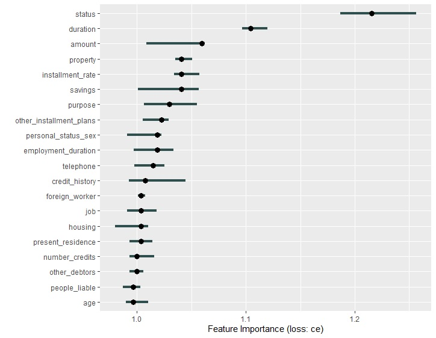

```{r setup, include=FALSE}
knitr::opts_chunk$set(echo = TRUE)
```

# Data set
For the Seminar we use the South German Credit dataset, available in the UCI Machine learning repository^[https://archive.ics.uci.edu/ml/datasets/South+German+Credit+%28UPDATE%29].

The data set consists of a 1000 observations together with 21 attributes. The data was collected between 1973 and 1975. The task associated with this data set is the classification of individuals (instances) according to their credit risk ("good", "bad").


| Attribute | Description                 |
| --------- |-----------------------------|
| status | Status of the debtor's checking account with the bank\
(factor with 4 levels: _"no checking account"_, _"... < 0 DM"_, _"0<= ... < 200 DM"_, _"... >= 200 DM / salary for at least 1 year"_) |
| duration | Credit duration in months (int) |
| credit_history | History of the compliance with previous or concurrent credit contracts\
(factor with 5 levels: _"delay in paying off in the past"_, _"critical account/other credits elsewhere"_, _"no credits taken/all credits paid back duly"_, _"existing credits paid back duly till now"_, _"all credits at this bank paid back duly"_) |
| purpose| Purpose for which the credit is needed\
(factor with 11 levels: _"others"_, _"car (new)"_, _"car (used)"_, _"furniture/equipment"_, _"radio/television"_, _"domestic appliances"_, _"repairs"_, _"education"_, _"vacation"_, _"retraining"_, _"business"_) |
| amount| Amount in DM (int) |
| savings| Debtor's savings\
(factor with 5 levels:  _"unknown/no savings account"_, _"... <  100 DM"_, _"100 <= ... <  500 DM"_, _"500 <= ... < 1000 DM"_, _"... >= 1000 DM"_) |
| employment_duration| Duration of debtor's employment with current employer\
(factor with 5 levels: _"unemployed"_, _"< 1 yr"_, _"1 <= ... < 4 yrs"_, _"4 <= ... < 7 yrs"_, _">= 7 yrs"_) |
| installment_rate| Credit installments as a percentage of debtor's disposable income\
(ordered factor with 4 levels: _">= 35"_ < _"25 <= ... < 35"_ < _"20 <= ... < 25"_ < _"< 20"_) |
| personal_status_sex | Combined information on sex and marital status\
(factor with 4 levels: _"male : divorced/separated"_, _"female : non-single or male : single"_, _"male : married/widowed"_, _"female : single"_) |
| other_debtors | Is there another debtor or a guarantor for the credit?\
(factor with 3 levels: _"none"_, _"co-applicant"_, _"guarantor"_) |
| present_residence| Length of time (in years) the debtor lives in the present residence\
(ordered factor with 4 levels: _"< 1 yr"_ < _"1 <= ... < 4 yrs"_ < _"4 <= ... < 7 yrs"_ < _">= 7 yrs"_) |
| property | The debtor's most valuable property\
(factor with 4 levels: _"unknown / no property"_, _"car or other"_, _"building soc. savings agr./life insurance"_, _"real estate"_) |
| age | Age in years (int) |
| other_installment_plans | Installment plans from providers oder than the credit-giving bank\
(factor with 3 levels: _"bank"_, _"stores"_, _"none"_) |
| housing | Type of housing the debtor lives in\
(factor with 3 levels: _"for free"_, _"rent"_, _"own"_) |
| number_credits | Number of credits including the current one the debtor has (or had) at this bank\
(ordered factor with 4 levels: _"1"_ < _"2-3"_ < _"4-5"_ < _">= 6"_) |
| job | Quality of debtor's job\
(factor with 4 levels: _"unemployed/unskilled - non-resident"_, _"unskilled - resident"_, _"skilled employee/official"_, _"manager/self-empl./highly qualif. employee"_) |
| people_liable | Number of persons who financially depend on the debtor (i.e., are entitled to maintenance)\
(factor with 2 levels: _"3 or more"_, _"0 to 2"_) |
| telephone | Is there a telephone landline registered on the debtor's name?\
(factor with 2 levels: _"no"_, _"yes (under customer name)"_) |
| foreign_worker | Is the debtor a foreign worker?\
(factor with 2 levels: _"yes"_, _"no"_) |
| credit_risk | Has the credit contract been complied with (good) or not (bad)?\
(factor with 2 levels: _"bad"_, _"good"_) |

\newpage
## Load data
```{r, include=FALSE}
# Load necessary libraries
library("mlr3verse")
library("ggplot2")

set.seed(20211301)
lgr::get_logger("mlr3")$set_threshold("error")
```

```{r}
load("south-german-credit.Rda")
task <- TaskClassif$new("german-credit", 
                        backend = data, 
                        target = "credit_risk", 
                        positive = "good")
```
 

```{r, warning=FALSE}
summary(data)
```
The data set doesn't have any missing values and requires little preprocessing to fit our model. It can also be pointed out that the data has class-imbalance problem: The number of "good" credited people is more than twice the number of "bad" credited people (700 to 300).

# Fitting some models
The `mlr3` package and other packages from the `mlr3` ecosystem are used to do the modeling.
The fitted and tuned models are:

- Logistic Regression
- Decision Tree
- Random Forest
- Xgboost
- Support Vector machines (with linear, polynomial, and radial kernels)

, in which, logistic regression and decision tree are considered as explainable baseline models; random forest, Xgboost and support vector machines with multiple kernel types as blackbox models.

For preprocessing, we do the following:

- Standardize numerical variables by centering them around their mean and scaling them by their root-mean-square.
- One-hot encode factor and ordered-factor variables.
- To account for the class imbalance in the data set, we perform oversampling of the minority class ("bad" class).
```{r}
# PipeOps
fencoder <- po("encode",
  method = "one-hot",
  affect_columns = selector_type("factor")
)
ord_to_int <- po("colapply",
  applicator = as.integer,
  affect_columns = selector_type("ordered")
)

encoder <- fencoder %>>% ord_to_int

po_over <- po("classbalancing",
  id = "oversample", adjust = "minor",
  reference = "minor", shuffle = FALSE, ratio = 2.3
)
threshold <- po("threshold")
pos <- po("scale") %>>%
  encoder %>>% po_over
```
## Tuning and Benchmarking
The parameter tuning is done with the following settings for all models. The tuning code is available in the `.Rmd` source file.
```{r}
# tuning settings
inner_cv5 <- rsmp("cv", folds = 5L)
measure <- msr("classif.bacc")
tuner <- tnr("grid_search", resolution = 7L)
terminator <- trm("evals", n_evals = 20)
```

```{r, eval=FALSE}
# Logistic regression
log_reg_learner <- lrn("classif.log_reg", predict_type = "prob")
log_reg_pipeline <- pos %>>% log_reg_learner %>>% threshold
log_reg_glearner <- GraphLearner$new(log_reg_pipeline, id = "log_reg")

log_reg_at <- AutoTuner$new(
  learner = log_reg_glearner,
  resampling = inner_cv5,
  measure = measure,
  search_space = ParamSet$new(list(ParamDbl$new("threshold.thresholds",
    lower = 0, upper = 1
  ))),
  terminator = terminator,
  tuner = tuner
)

# Regression trees
rpart_learner <- lrn("classif.rpart", predict_type = "prob")
rpart_pipeline <- pos %>>% rpart_learner %>>% threshold
rpart_glearner <- GraphLearner$new(rpart_pipeline, id = "rpart")

rpart_at <- AutoTuner$new(
  learner = rpart_glearner,
  resampling = inner_cv5,
  measure = measure,
  search_space = ParamSet$new(list(ParamDbl$new("threshold.thresholds",
    lower = 0, upper = 1
  ))),
  terminator = terminator,
  tuner = tuner
)

# Random forest
ranger_pipeline <- pos %>>% lrn("classif.ranger",
  predict_type = "prob"
) %>>% threshold
ranger_glearner <- GraphLearner$new(ranger_pipeline, id = "ranger")

ranger_tune_ps <- ParamSet$new(list(
  ParamDbl$new("threshold.thresholds", lower = 0, upper = 1),
  ParamInt$new("classif.ranger.num.trees",
    lower = 100, upper = 140
  ), # number of trees
  ParamInt$new("classif.ranger.mtry",
    lower = 1, upper = ceiling(task$ncol / 2)
  ), # number of variables to possibly split at in each node
  ParamInt$new("classif.ranger.max.depth",
    lower = 2, upper = 20
  ) # maximum depth of the tree
))

ranger_at <- AutoTuner$new(
  learner = ranger_glearner,
  resampling = inner_cv5,
  measure = measure,
  search_space = ranger_tune_ps,
  terminator = terminator,
  tuner = tuner
)

# Svms
linear_svm_learner <- lrn("classif.svm",
  type = "C-classification", kernel = "linear",
  predict_type = "prob"
)
poly_svm_learner <- lrn("classif.svm",
  type = "C-classification", kernel = "polynomial",
  predict_type = "prob"
)
radial_svm_learner <- lrn("classif.svm",
  type = "C-classification", kernel = "radial",
  predict_type = "prob"
)

# Pipelines
linear_svm_pipeline <- pos %>>% linear_svm_learner %>>% threshold
poly_svm_pipeline <- pos %>>% poly_svm_learner %>>% threshold
radial_svm_pipeline <- pos %>>% radial_svm_learner %>>% threshold

# Learners
linear_svm_glearner <- GraphLearner$new(linear_svm_pipeline, id = "linear_svm")
poly_svm_glearner <- GraphLearner$new(poly_svm_pipeline, id = "poly_svm")
radial_svm_glearner <- GraphLearner$new(radial_svm_pipeline, id = "radial_svm")

# Search spaces
poly_svm_search_space <- ParamSet$new(list(
  ParamDbl$new("threshold.thresholds", lower = 0, upper = 1),
  ParamDbl$new("classif.svm.cost", lower = 0.01, upper = 100),
  ParamDbl$new("classif.svm.gamma", lower = 0.0001, upper = 1),
  ParamInt$new("classif.svm.degree", lower = 1, upper = 4)
))

radial_svm_search_space <- ParamSet$new(list(
  ParamDbl$new("threshold.thresholds", lower = 0, upper = 1),
  ParamDbl$new("classif.svm.cost", lower = 0.01, upper = 100),
  ParamDbl$new("classif.svm.gamma", lower = 0.0001, upper = 1)
))

linear_svm_search_space <- ParamSet$new(list(
  ParamDbl$new("threshold.thresholds", lower = 0, upper = 1),
  ParamDbl$new("classif.svm.cost", lower = 0.01, upper = 100)
))

linear_svm_at <- AutoTuner$new(
  learner = linear_svm_glearner,
  resampling = inner_cv5,
  terminator = terminator,
  search_space = linear_svm_search_space,
  tuner = tuner,
  measure = measure
)
poly_svm_at <- AutoTuner$new(
  learner = poly_svm_glearner,
  resampling = inner_cv5,
  terminator = terminator,
  search_space = poly_svm_search_space,
  tuner = tuner,
  measure = measure
)
radial_svm_at <- AutoTuner$new(
  learner = radial_svm_glearner,
  resampling = inner_cv5,
  terminator = terminator,
  search_space = radial_svm_search_space,
  tuner = tuner,
  measure = measure
)
```
```{r, include=FALSE, eval=FALSE}
outer_cv3 <- rsmp("cv", folds = 3L)
design <- benchmark_grid(
  task = task,
  learners = list(
    log_reg_at,
    rpart_at,
    ranger_at,
    linear_svm_at,
    poly_svm_at,
    radial_svm_at
  ),
  resamplings = outer_cv3
)
bmr <- benchmark(design)
```

```{r, eval=FALSE}
autoplot(bmr, measure = msr("classif.fbeta")) +
  theme(axis.text.x = element_text(angle = 45, hjust = 1))
```
```{r evaluation-results, out.width='80%', fig.align='center', fig.cap="Evaluation", echo=FALSE}

```

As can be seen from the Figure \@ref(fig:evaluation-results), the tuned SVM using radial basis kernel has the best performance (highest F1 score) and therefore is used for subsequent interpretations. We also observe that the performace of tree based models doesn't change significantly, when categorical variables are not coverted to numerics (See box plots in Figure labeled `fct_`).

```{r, eval=FALSE}
radial_svm_at$predict_type = "prob"
radial_svm_at$train(task)
```

# Interpretable Machine Learning Methods and Hypotheses
We first give a brief description of some interpretable machine learning methods we would use to investigate our hypotheses. The methods are more thoroughly described in the Interpertable Machine Learning book^[https://christophm.github.io/interpretable-ml-book/].

## Interpretable Machine Learning Methods

### Feature Effects

**Partial Dependence Plot (PDP):** It shows the marginal effect a feature has on the output of a model.

**Accumulated Local Effects (ALE) Plots:** A faster and unbiased alternative to PDP. It calculates the differences in predictions instead of averages.

**SHAP Dependence Plots:** An alternative to PDP to visualize feature effects on the model output.

**SHAP Summary Plots:** Visualizes feature importance and effects in a single plot.

### Global Feature Importance

**Permutation Feature Importance:** It measures the increase in prediction error after permuting the feature values.

### Feature Interaction

**H-Statistic:** Friedman's H-Statistic can tell us two things. (1) Whether and to what extent a feature interacts with all other features in the model and (2) whether and to what extent two features interact with one-another.

### Local Interpretation Methods

**Anchors:** Provides an "anchor" explanation of individual model predictions. The "anchor" explanation is a decision rule, where-in unaccounted variables do not affect the prediction.

### Example-Based Explanations

**Counterfactual Explanations:** A counterfactual explanation of a prediction describes the smallest change to the feature values that changes the prediction to the predefined output.


## Hypotheses and Suggested IML Methods
To work on this part, we use the IML methods implemented in the package `iml`
```{r, eval=FALSE}
library(iml)
```

|Hypothesis|IML Method|
|----------|----------|
|What are the most important features for the prediction of the `credit_risk`|Permutation Featurn Importance|
|Having no `property` should imply a bad `credit_risk`|ALE|
|Is being older better for `credit_risk`|ALE|
|Is there an interaction between `job` and `credit_history`? People with delayed `credit_history` often have low quality `job`|H-Statistic|
|What is the smallest change in `number_credits` that can toggle the model output from `good` to `bad`|Counterfactual Explanations|
|People with high quality `job`s have good `credit_risk`|SHAP Feature Importance & SHAP Summary Plots|
|How strong is the interaction between each feature and other features in German Credit Dataset?|H-Statistic|
|Does having no `property` mean bad `credit_risk` and how does this relate to age|Anchors, H-Statistic|
|Being a foreign worker does not affect your credit risk. If this feature is important for prediction, this implies discrimination|Permutation Feature Importance & ALE|
|The better the savings, the better your credit risk|Permutation Feature Importance, SHAP Feature Importance & SHAP Summary Plots|
|How does a change in the `savings` threshold change the `credit_risk`|ALE, Counterfactual Explanations|
|The higher the `installment_rate` the better the `credit_risk`|Partial Dependence Plot, SHAP Dependence Plot & SHAP Summary Plots|
|Does owning a house (`housing`) mean good `credit_risk`|Partial Dependence Plot, SHAP Dependence Plot & SHAP Summary Plot|

1. What are the most important features for the prediction of the `credit_risk`?\
The importance of features can be uncovered using Permutation Feature Importance (Figure \@ref(fig:feature-importance)). Through the increase in the prediction error, we can see that the most important feature for predicting `credit_risk` is `status` of your checking account, which stands out from the other features of the dataset. It is followed by `duration`, `purpose`, `amount`, `credit_history`, `installment_rate`, etc. with gradual decrease in the importance.
```{r, eval=FALSE}
imp <- FeatureImp$new(model, loss="ce")
plot(imp)
```
```{r feature-importance, out.width='80%', fig.align='center', fig.cap="German Credit Feature Importance", echo=FALSE}

```


2. Having no `property` should imply a bad `credit_risk`\
NaN


3. Is being older better for `credit_risk`?\
To answer this question, we use the ALE plot (Figure \@ref(fig:ale-age)). The ALE plot shows a linear relationship between the predicted probability and `age`. The model confirms that the older we get, the better influence we have on the credit score.
```{r, eval=FALSE}
eff <- FeatureEffect$new(model, feature = c("age"), method='ale')
eff$plot()
```
```{r ale-age, out.width='80%', fig.align='center', fig.cap="ALE Plot of `age`", echo=FALSE}
knitr::include_graphics("plots/ale_age.jpg")
```

4. Is there an interaction between `job` and `credit_history`? People with delayed `credit_history` often have low quality `job`\
NaN

5. What is the smallest change in `number_credits` that can toggle the model output from `good` to `bad`?\
NaN

6. People with high quality `job`s have good `credit_risk`\
ALE plot continues to be used to answer this question (Figure \@ref(fig:ale-job)). According to the plot, being unskilled and non-resident or being manager/high qualified employee causes a loss in your credit score while being skilled employees or just being a resident can have a positive effect on your credit score. This raises some questions for us to think about. Why are both unskilled but 
being resident has good effect on the credit and bad effect otherwise? Is it some kind of discrimination to foreigners? The plot also shows that being a high-qualified employee has the worst effect on the credit, which is an absurd thing. These may be explained due to the fact that the dataset is relatively small so it may possess high variance.
```{r, eval=FALSE}
eff <- FeatureEffect$new(model, feature = c("job"), method='ale')
eff$plot()
```
```{r ale-job, out.width='80%', fig.align='center', fig.cap="ALE Plot of `job`", echo=FALSE}
knitr::include_graphics("plots/ale_job.jpg")
```

7. How strong is the interaction between each feature and all other features in German Credit Dataset?\
To answer the question, we calculate the H-statistic between each feature and all other features. The result is presented in Figure \@ref(fig:interaction). As can be seen, the interactions are not strong where the highest is just approximately 0.11.
```{r, eval=FALSE}
ia <- Interaction$new(model)
plot(ia)
```
```{r interaction, out.width='80%', fig.align='center', fig.cap="Interaction Strength (H-Statistic) between each feature and all other features", echo=FALSE}
knitr::include_graphics("plots/interaction.jpg")
```

8. Does having no `property` mean bad `credit_risk` and how does this relate to age\
NaN

9. Being a foreign worker does not affect your credit risk. If this feature is important for prediction, this implies discrimination.\
As can be seen from Figure \ref(fig:feature-importance), `foreign_worker` is the 6th least important feature in 20 features in total. Looking at the ALE plot for `foreign_worker` in Figure \ref(fig:ale-foreign-worker), we notice a strange phenomenon. If you are a foreign worker, it brings positive effect to your credit, and otherwise, a slight negative effect. However, this can be explained by the distribution of the feature (Figure \ref(fig:geom-bar-foreign-worker)). The proportion of foreign workers is less than 4% the proportion of native workers (37 to 963) and almost 90% of the foreign workers in the dataset has good credit however only about 70% of the native workers in the dataset has good credit.

```{r}
summary(data$foreign_worker)
```

```{r, eval=FALSE}
eff <- FeatureEffect$new(model, feature = c("foreign_worker"))
eff$plot()
```
```{r ale-foreign-worker, out.width='80%', fig.align='center', fig.cap="ALE Plot for `foreign_worker`", echo=FALSE}

```

```{r, eval=FALSE}
ggplot(data = data, mapping = aes(x = foreign_worker, fill = credit_risk)) + geom_bar()
```
```{r geom-bar-foreign-worker, out.width='80%', fig.align='center', fig.cap="Bar Plot for `foreign_worker` with distribution of `credit_risk` in each level", echo=FALSE}
knitr::include_graphics("plots/geom_bar_foreign_worker.jpg")
```

10. The better the savings, the better your credit risk\
We continue to use ALE plot to answer this question. Looking at the plot in Figure \ref(fig:ale-savings), it is clear that the more money for savings, the more positive effect it has on your credit risk. And if there is no savings account, the credit can suffer.
```{r, eval=FALSE}
eff <- FeatureEffect$new(model, feature = c("savings"))
eff$plot()
```
```{r ale-savings, out.width='80%', fig.align='center', fig.cap="ALE Plot for `savings`", echo=FALSE}
knitr::include_graphics("plots/ale_savings.jpg")
```

11. The higher the `installment_rate` the better the `credit_risk`\
NaN

12. Does owning a house (`housing`) mean good `credit_risk`\
NaN


